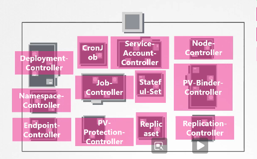

# Kube Controller manager 

the Kube Controller manager are continuously on the lookup for the ships, and remediate the situation.

## The Node-Controller

is responsible for monitoring the status of the nodes and takes the necessary actions to keep the application running through the kube-apiserver.

it checks the status of the nodes every 5 seconds if it stops to receiving heart beat from the node it's unready, nut it waits for 40 seconds before marking it as unreachable, it then give it a 5 min min before it provision another node

Node Monitor Period =5s

Node Monitor Grace Period = 40s

POD Eviction Timeout= 5m

## The Replication controller

it's responsible for monitoring the replicasets and the desired number of pods are available at all time within the node, and if a pod does it creates a new one.

## Others

all of these controllers are packed into a single process called kube-controller-manager

to install it you download it from the kubernetes release page extract and run it as a service, when you run it a list of options is shown.

kubeadm install the kube-controller-manager as a pod on the master node. and the manifest file is in `/etc/kubernetes/manifests/kube-controller-manager.yaml`

and you can inspect the options from `/etc/systemd/system/kube-controller-manager.service`

`ps -aux | grep kube-controller-manager`
