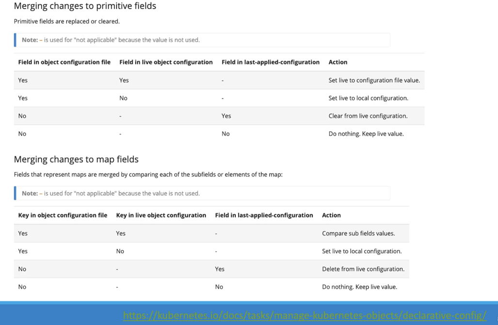

# How does the `kubectl apply` works internally

there are 3 types of configuration definition files:

1- **the local file** that we made the definition.yaml file we wrote.

2- **last applied configuration file:**

this file is a direct result from the apply command, which is our local yaml file, converted into json file, and saved internally into Kubernetes.

3- Kubernetes internal **live object configuration file:**

this is the live file of the object which is changed with any imperative or declarative changes.

* * *

**those 3 files are compared for any updates applied, and to determine what updates to be made on the live oobject.**

**so why do we need the last applied configuration file?**

it's need as a level of rollback or auditing for the updates and changes made on the local file, which was not there in the last time applied, which means a change was made.

the **last applied configurations** are stored into the **live object configuration** in a json notation with the same name.
