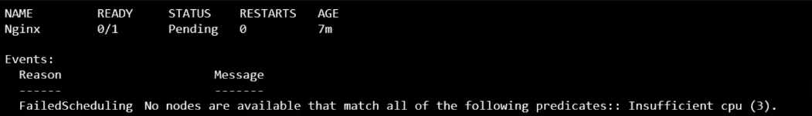

# Resource requirements and limits

## Requests

every pod requires some resources like cpu,memory, and disk. For each node the scheduler distributes these pods based on the nodes resources left, and if the resources are not sufficient on any of the nodes, the pod will be placed on pending state and the reason will be described as below.



this happens when the requested resources are not found

```yaml
 resources:   
   requests:   
     memory:  "64Mi"   
     cpu:  "250m"

```

requests are the resources allocated for this pod

## Limits

on the other hand, limits are to limit the pod from exceeding a certain amount of resources because the pod has no limitation for the resources if it consumes.

so what happens when the pod exceeds the limits?

in case of the CPU, Kubernetes throttles the cpu if it exceeds the limit

and in case of memory, Kubernetes terminate the whole pod if it exceeded the memory limit.

## Notes

When a pod is created the containers are assigned a default CPU request of .5 and memory of 256Mi.

you have to create a limitation for the default if you need a default one

```YAML
apiVersion: v1
kind: LimitRange
metadata:
  name: cpu-limit-range
spec:
  limits:
  - default:
      cpu: 1
    defaultRequest:
      cpu: 0.5
    type: Container
```

https://kubernetes.io/docs/tasks/administer-cluster/manage-resources/memory-default-namespace/

```YAML
apiVersion: v1
kind: LimitRange
metadata:
  name: mem-limit-range
spec:
  limits:
  - default:
      memory: 512Mi
    defaultRequest:
      memory: 256Mi
    type: Container
```

https://kubernetes.io/docs/tasks/administer-cluster/manage-resources/cpu-default-namespace/

to get the resource metrics

https://kubernetes.io/docs/tasks/debug/debug-cluster/resource-metrics-pipeline/ 

**References:**

https://kubernetes.io/docs/tasks/configure-pod-container/assign-memory-resource
