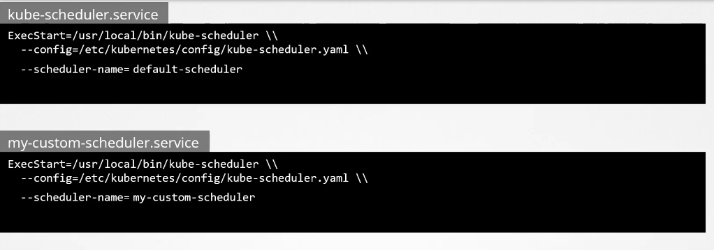

# Multiple Schedulers

sometimes all the scheduling methods does not work with your application and you can customize your own scheduler using a scheduling algorithm of your own.

and to do so, you need to download the scheduler binaries and define it, or create binary yourself

first thing to know is the default scheduler name which is default-scheduler and this name is placed in /etc/kubernetes/manifests/kube-scheduler.yaml, if you downloaded a scheduler, you need to specify set the scheduler name:



## Important Note

in multiple nodes in high availability environment if there is multiple schedulers with the same name, only one will be running at a time, that is determined by the leader elect option in the cluster, simply the leader will lead scheduling activity.

so in case you need to start multiple scheduler together:

1- in case there is no multiple master nodes ----> just disable the leader elect options

2- in case of one master node ---> you just need to parse this option in the /etc/kubernetes/manifests/kube-scheduler2.yaml `lock-object-name=my-custom-scheduler` this is to differentiate between the new customized scheduler from the default running scheduler during the election of the leader scheduler

you can view the events of the scheduler in `kubectl get events -n=kube-system` and filter with the kube-scheduler

to view the logs use `kubectl logs kube-scheduler -n=kube-system`

once done, if the manifest is not at /etc/kubernetes/manifests, you can just create it using kubectl create -f 

to make the pod use the scheduler, you need to set a username in the yaml manifest file.

```YAML
apiVersion: v1
kind: pod
metadata:
  name: pod1
spec:
  containers:
    name: nginx
    image: nginx
  schedulerName: my-scheduler
```

sideNode

what is a configmap object 

kubectl create -n kube-system configmap my-scheduler-config --from-file=/root/my-scheduler-config.yaml

```YAML
apiVersion: kubescheduler.config.k8s.io/v1beta2
kind: KubeSchedulerConfiguration
profiles:
  - schedulerName: my-scheduler
leaderElection:
  leaderElect: false
```

this file is parsed in the yaml file of the scheduler pod in the volum secion in the config map

```YAML
spec:
  serviceAccountName: my-scheduler
  containers:
  - command:
    - /usr/local/bin/kube-scheduler
    - config=/etc/kubernetes/my-scheduler/my-scheduler-config.yaml
    image: <image>
    name:
    resources:
    volumeMounts:
      - name: config-volume
        mountPath: /etc/kubernetes/my-scheduler
    volume:
      - name: config-volume
      configmap:
        - name: my-scheduler-config
```
