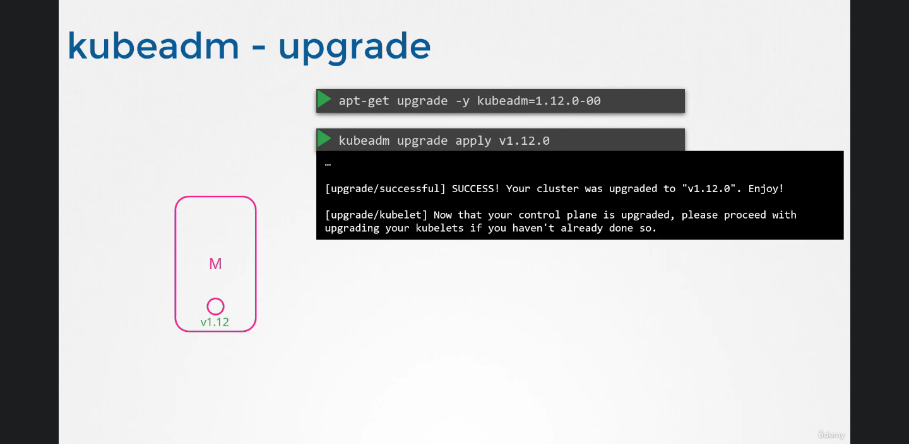

# Kubernetes Upgrade

for the components of Kubernetes, it's not necessary to be all the same Version, but the Api Server, as the main component, it can't be lower in the version than any other component, the controller manager and scheduler can be one level lower, kubelet and kubeproxy can be 2 versions lower, and the kubectl can be one version higher or lower as shown below

this permissible SKU in versions allows to carry out live upgrades component by component

## when should you Upgrade?

kubernetes only support 2 previous version, so if you are at v1.11 and v1.13 you need to upgrade as soon as possible because once the 1.14 version is out, 1.11 is not supported anymore

**important note:** the recommended approach while upgrading is upgrading by one minor version at a time meaning from 1.12 to 1.13 and then from 1.13 to 1.14.

## How do you Upgrade?

\- if you are in a cloud provider, google kubernetes engine makes you upgrade your cluster in just a few clicks.

\- if you deployed the kubernetes from kubeadm, this utility helps you plan and upgrade using the following commands

   `kubeadm upgrade plan`

   `kubeadm upgrade apply`

\- finally if you deployed the kubernetes components manually on your cluster, you will have to upgrade them one by one.

### the way it should goes

the first kubernetes component or node to be upgraded is the controlplane or ApiServer with the scheduler/etcd/any other component on the controlplane, what you need to know is that the controlplane down does not mean that the service is down or the other nodes won't serve the users.

### strategies to upgrade the worker nodes:

1- to upgrade all of them at once witch will make a down time.

2- to upgrade one by one, which will make no downtime, but there is some service degradation

3- to create new nodes with the new version, and move all the objects of the nodes on the new nodes ( made by cloud provides)

### kubeadm:

`kubeadm upgrade plan`

this command in kubeadm lists all the data needed to figure out the versions of the kubernetes, and there is **hint **you must take care of, which is the kubeadm does not upgrade the **kubelet**.

note that, you need to upgrade the kubeadm prior to the upgrade that you will make, and remember that it needs to be done one at a time.

all the commands and that needs to be done is in the `kubeadm upgrade plan`

after the upgrade of the apiserver components, the nodes will still give the old version is you run the command of kubectl get nodes, that is because the kubelet is not upgraded yet, to do so:

* * *

### now it's time to upgrade all the worker nodes

to do so you need to first run the drain command to remove all the objects from the node

`controlplane$ kubectl drain node01` this is to be run from the controlplane

on the worker node:

`node01$ apt-get upgrade -y kubeadm=1.12.0-00`

`node01$ apt-get upgrade -y kubelet=1.12.0-00`

`node01$ kubeadm upgrade node config --kubelet-version v1.12.0`

`node01$ systemctl restart kubelet`

then return back to master node to uncordon the node:

`controlplane$ kubectl uncordon node01`
