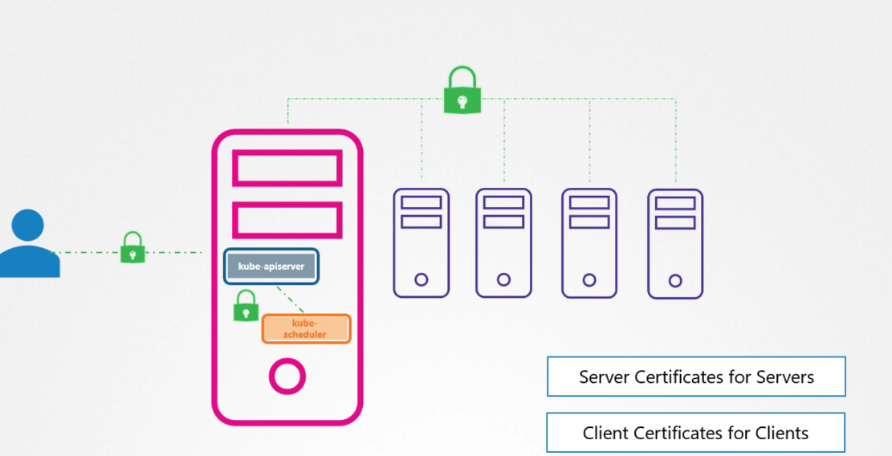
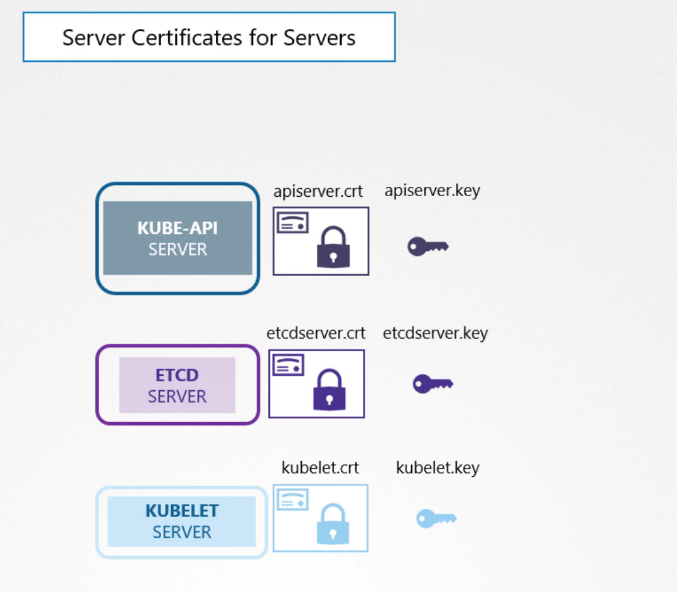
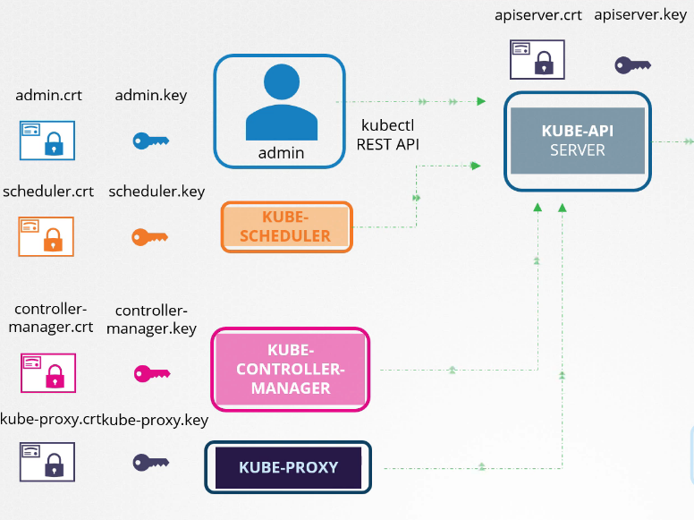
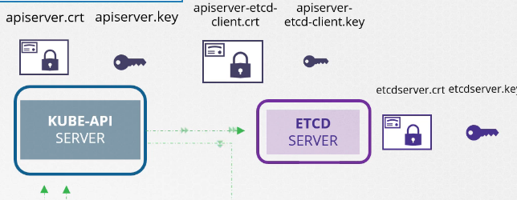
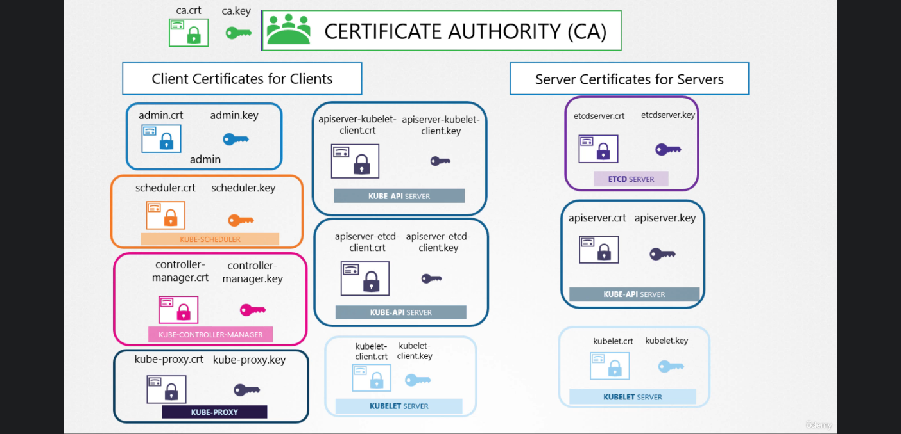

# TLS in Kubernetes

it's important that all the connections between all Kubernetes component be secure by TLS

that includes connections between an admin and API Server, API Server and all Components, and Masternode and all the other nodes.

* * *

## identifying the server components ( components that other clients connect to)

for Clients Certificates:

### 1- Kube-Apiserver clients:

### 2- ETCD Server Clients

and that is only the Kube-Apiserver, which is the only one talking to the ETCD Server

you can either provide the kube-Apiserver public key or create a new pair specific for the etcd server

### 3- kubelet Server Clients

it's Exactly the same as ETCD, with the kube-apiserver

* * *

**Important note:**

Kubernetes requires you to have at least one CA in the Cluster and the certificates for that CA is ca.crt and ca..key

* * *

