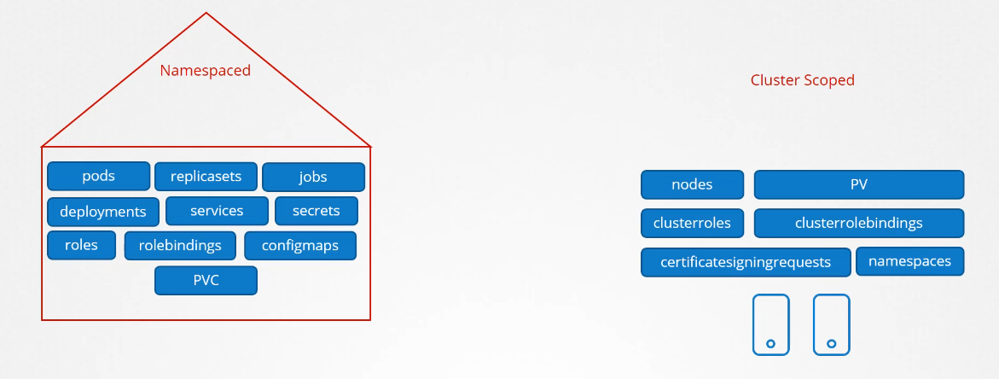

# Cluster Roles and Cluster role bindings

objects in the clusters are devided into Namespaced and non-name-spaced



to get a list of all resources

`kubectl api-resources --namespaced=false/true`

the cluster rule and cluster rule bindings are similar to the rule bindings but you specify a non-namedspaced in it, examples below

```YAML
apiVersion: rbac.authorization.k8s.io/v1
kind: ClusterRole
metadata:
  # "namespace" omitted since ClusterRoles are not namespaced
  name: secret-reader
rules:
- apiGroups: [""]
  #
  # at the HTTP level, the name of the resource for accessing Secret
  # objects is "secrets"
  resources: ["secrets"]
  verbs: ["get", "watch", "list"]
```

and a cluster rule binding

```YAML
apiVersion: rbac.authorization.k8s.io/v1
# This cluster role binding allows anyone in the "manager" group to read secrets in any namespace.
kind: ClusterRoleBinding
metadata:
  name: read-secrets-global
subjects:
- kind: Group
  name: manager # Name is case sensitive
  apiGroup: rbac.authorization.k8s.io
roleRef:
  kind: ClusterRole
  name: secret-reader
  apiGroup: rbac.authorization.k8s.io
```

Important note: namescpaced objects can have a cluser rule, which makes it able to access the resources across all namespaces
