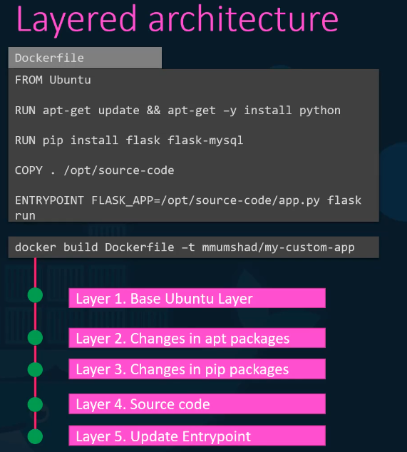
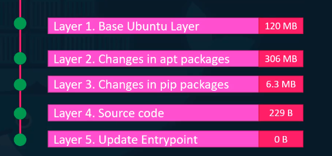
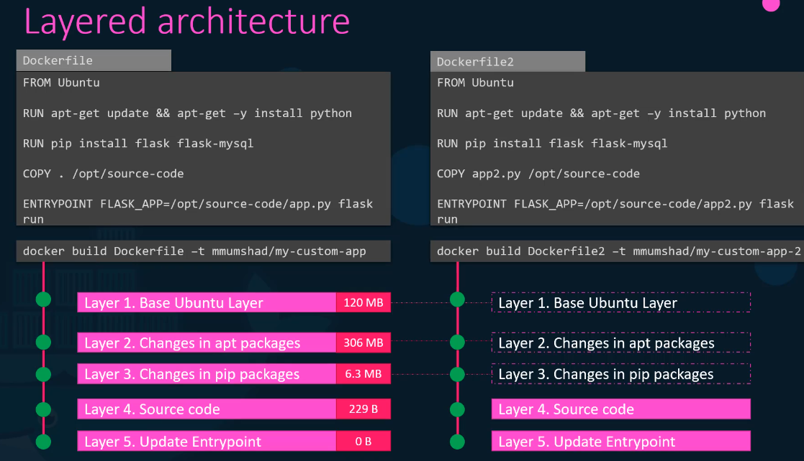
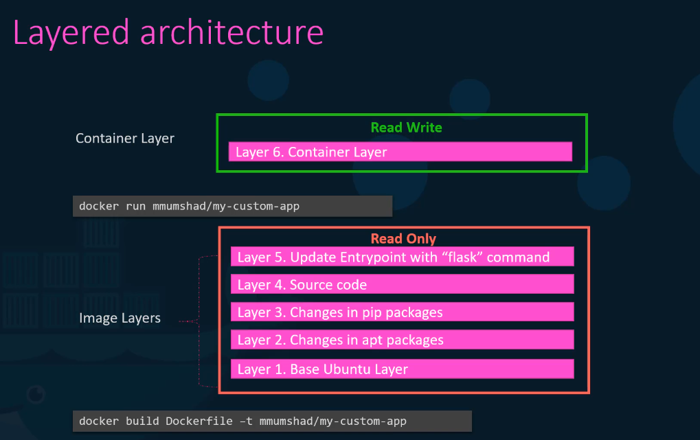
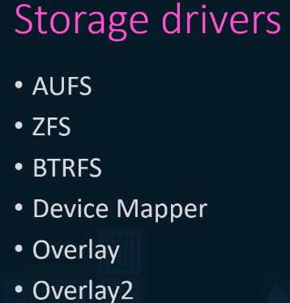
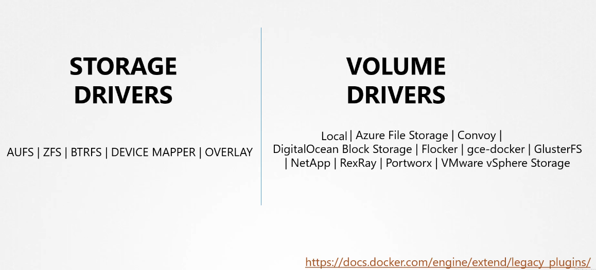

# Docker Storage

when you install docker it creates this file system at /var/lib/docker which contains directories like aufs, containers, images, volumes.

## layered architecture

when docker builds images, it builds it in a layer architecture

 

and since each layer holds only the changes from the previous layer, it's reflected on the size as well

to understand the importance and the benifits of the layer architecture, let's compare two docker files that differ in kust layer 4 and 5, so instead of re-create the 3 first layers, it uses the files in the cash from the first application. this way docker builds images faster and saves more disk space

so once you build the images, these layers are just read-only, and only modified by initiating a new build.

when you run a container based on this image, docker creates a new writable layer, the writable layer is used to store data created by the container such as log files, modiefied files, tmp files. and this layer is only alive while the container is a live, and the lower layers are shared by all the containers using this image

### Copy on Write

if I to make any changes from the lower layers, docker automatically copies the needed to be modified files to the read-write layer, this is called copy on write mechanism.

when you delete or stop the docker container, it deletes all the data in the container along with the container, which means all the newly created files all the tmp files are gone, this is when Persistent Volumes comes in.

## Persistent Volumes

### Volume Mounting ( from the /var/lib/docker/volumes)

to create a volume you simply run the `docker volume create volume1` , it then creates a volume under `/var/lib/docker/volumes/volume1` and then we can mount this volume inside the newly created container, using the run -v option, which makes the folder read-writable for the container `docker run -v volume1:/var/lib/mysql mysql` after that when you run another instance using the the same volume, using `docker run -v volume2:/var/lib/mysql mysql2 `you will find the data that was saved

### Bind Mounting ( from a specified directory)

when you already have the volume with the data that needs to be mounted on the docker container, you can then specify the full path to the folder that needs to be mounted, docker r`un -v /data/mysql:/var/lib/mysql mysql` this is called bind mounting

it's preferred to use mount option instead of -v because it's more Verbale

`docker run --mount type=bind,source=/data/mysql,target=/var/libe/mysql mysql`

## Storage Driver

the Storage drivers are the ones that maintain the layered architecture and the one responsible for mounting the volumes

the storage drivers vary from one os to another for ubuntu it's AUFS docker will choose the best storage drivers based on the os used, and different storage drivers provides different performance and stability.

## Volume Drivers Plugins

volumes are not handled by storage drivers, volumes are handled by volume driver plugins, default is \*\*local, \*\* the local volume plugin helps create volume on the docker host and store the data on /var/lib/docker/volume directory, there are any volume driver plugins

when you excute the docker run command you can specify the volume driver plugin to use that suites your needs like for example RexRay volume driver plugin which privsions a volume frome amazon ebs, that way you run the container and attach the rexray ebc plugin to provision a volume from amazon ebs when the container exits your data is saved in the cloud.

`docker run -it --name=mysql --volume-driver rexray/ebs --mount src=ebs-vol1,tager=/var/lib/mysql mysql`
