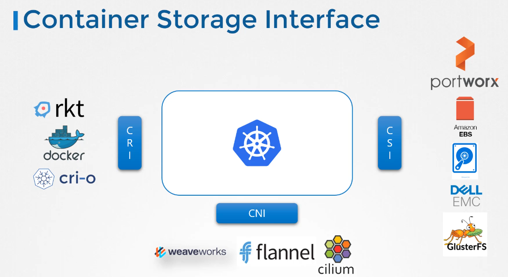
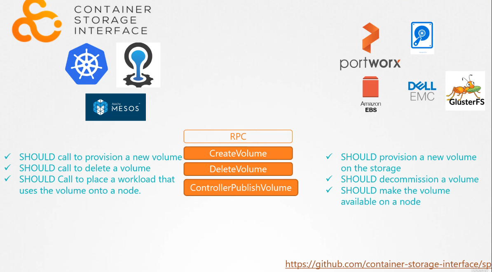

# CSI

## Container Runtime Interface (CRI)

when kubernetes first came to worked only with docker, but after other container runtime came along it was need to deal with them in kubernetes.

CRI is standard that defines how an orchestration solution like kubernetes with container runtime like doker or cri-o. so in the future if any new runtime i developed, they can simply follow the CRI standard, and that new container runtime would work with kuberenetes

## Container Network Interface

and to extend support for different network solutions the container network interface was introduced, similarly, any new network plugin can introduce their plugins with the CNI Standards and work the kubernetes

## Container Storage interface

Similarly the container storage interface, with CSI you can write you own drivers with your own storage to work with kubernetes

it's a universal standard that works with any container orchestration tool to work with any plugin for any containers tool

here's how it works,

it defines some set of RPC, remote procedure calls that will be called by the container orchestrator and these must be implemented by the storage drivers, for example,

CSI says when pod is created and required volume the container orchestration should call the create volume RPC and pass a set of details suck as the volume name.

the Storage Drivers should handles that call and creates a new volume and store it under the storage array and return the results of the operation.

similarly when a pod is deleted, the container orchestration tool should call the delete volume RPC and the storage drivers should implement the code to decommission the volume from the storage array
