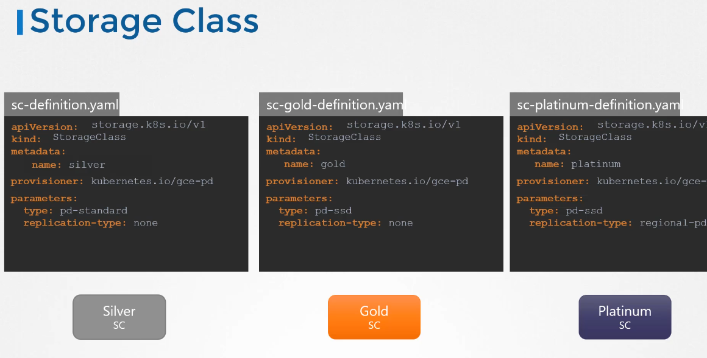

# Storage Classes

to create the volume on google cloud you have to manually provision the disk on google cloud first and then manually create the volume and volume claims, this is called Static Provisioning

## Static Provisioning Vs Dynamic Provisioning

with storage classes you can automatically provision storage to google cloud and attach that to pods when a claim is made.

what we do we create the storage class and link the PVC with the storage class name, and when it tries to provision a new volume, it automatically creates a PV and link it to the pod.

```YAML
apiVersion: storage.k8s.io/v1
kind: StorageClass
metadata:
  name: standard
provisioner: kubernetes.io/aws-ebs
parameters:
  type: gp2
reclaimPolicy: Retain
allowVolumeExpansion: true
mountOptions:
  - debug
volumeBindingMode: Immediate
```

this is called storage classes because you can create a different classes of storage services, which defines what you need to do in the definition file and the volume like below


