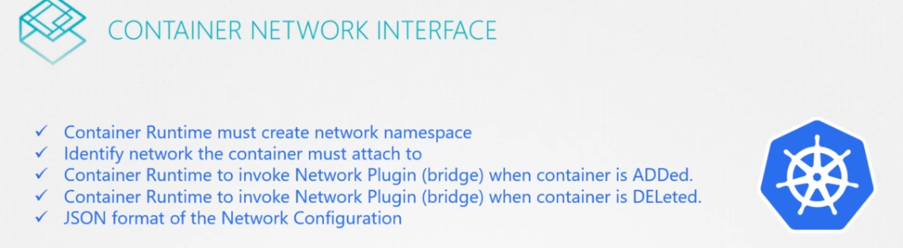
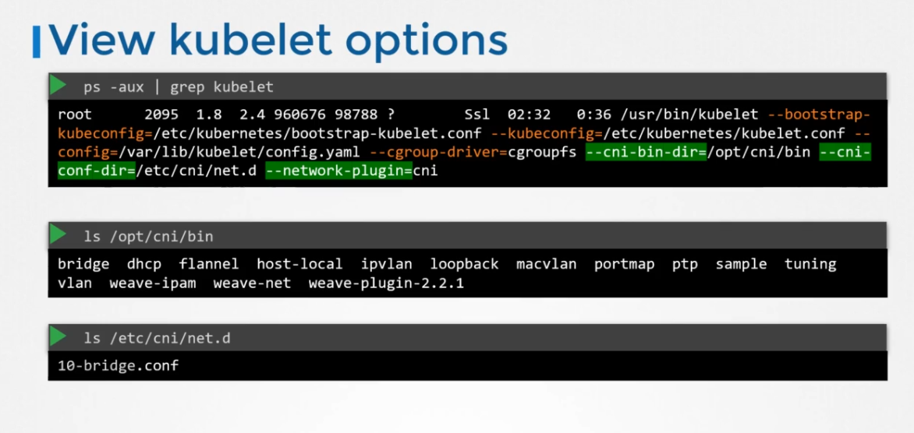
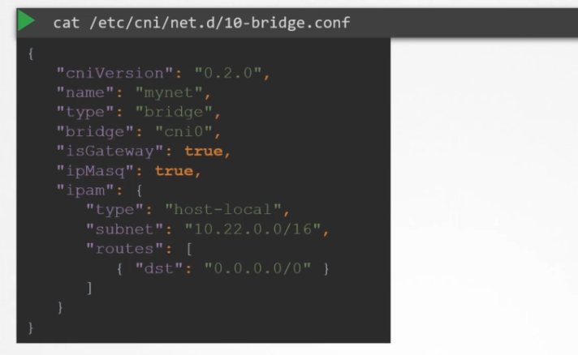

# CNI in Kubernetes

CNI as discussed defines the responsibilities of container run-time (docker)

so where is the CNI configured?

the CNI and network plugin are configured inside the kubelet service in the cluster

CNI Configurations can be found in the kubelet service that is running on the nodes, the cni/bin directory is where the network plugins are in, and the cni/net.d (configuration directory) is where the kubelet knows which plugin to be used.

in this case it's the bridge.conf, and if there is multiple files, it chooses with alphabetical order

