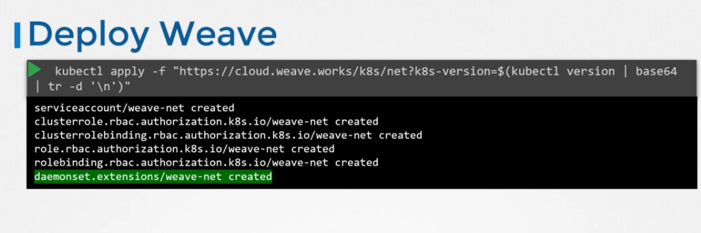

# Weave Works CNI Plugin

Weave CNI plugin when run it deploys an Agent on every node that makes a weave network, they communicate with each other to get information about nodes, network and pods within the, each agent or peer, stores a topology of the entire setup that way they know the pods and ips of the other nodes.

weave creates it's own bridge and name it weave then assign an IP address to each network.

note that a single pod, maybe attached to multiple bridge networks for example ( maybe attached to weave and docker bridges ) what way to take to connect is weave responsibility, weave makes sure that pods get the correct route configured to reach the agent. and the agent then takes responsibility to reach the dest pod.

## How a packet is trasfered from a pod to another

weave takes the pod packet, inspect it and find that it's on another network, it then encapsulate it with a new dest and source network and send it across the weave network, once it gets to the other weave agent, receives the packet, decapsulate it and send it to the dest pod.

## Deploying weave works

weave and weave agent can be deployed as services or daemons on every node in the cluster, or an easier way to deploy is to deploy them as pods in the cluster.

simple command like below can deploy them as a **Daemonset**  daemonsets makes sure that one of the same pod is deployed on each node of the cluster



to deploy the weave with a new network range:

```shell
`kubectl apply -f "https://cloud.weave.works/k8s/net?k8s-version=$(kubectl version | base64 | tr -d '\n')&env.IPALLOC_RANGE=10.50.0.0/16"`
to inspect the errors
```

```shell
kubectl logs -n kube-system weave-net-6mckb -c weave
```

weave creates the IP address range from 10.32.0.0 up to 10.47.255.254
and it assigns the following ips to the nodes 10.32.0.0, 10.38.0.0, and 10.44.0.0
