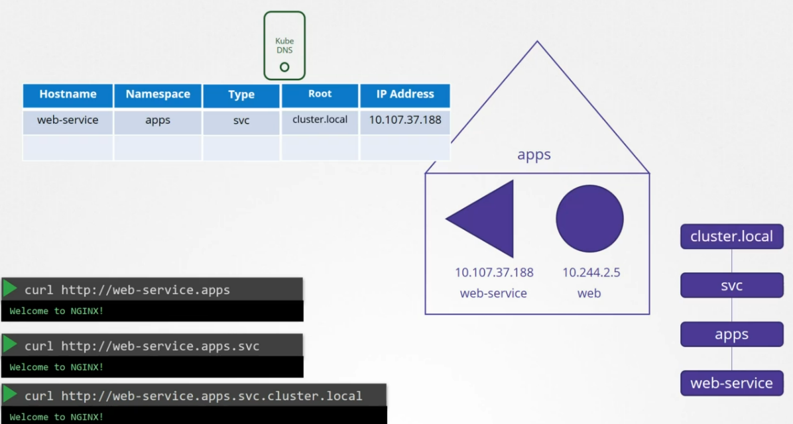
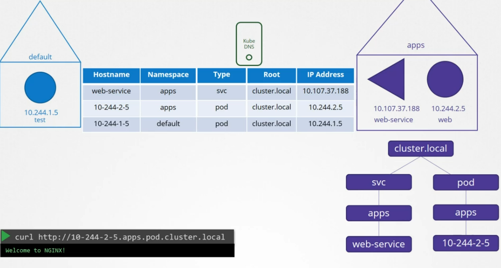
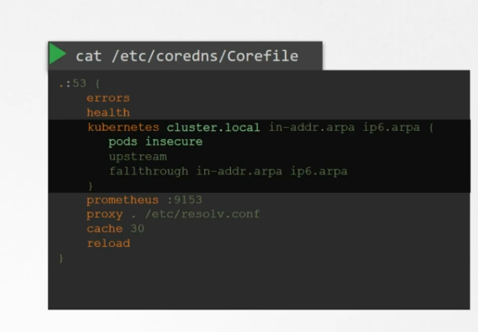
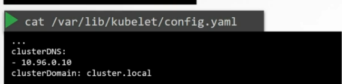

# DNS

the Domain Name service is concerned in managing the FQDN of any component of the cluster, any object from the same namespace can address each another with the first name, but object in different namespaces address each others with the full name.

## Services

services have another subdomain called svc

## root Domain

the root domain for the cluster is called cluster.local

### to summarize:

to address for example a service called web-service : web-service.apps.sv.cluster.local

## Pods

for pods it's a little different, because they are not set up default, when set, the dots in the ip of each pod is replaced by - and the sub-domain ( type ) is set to pod

# CodeDNS

it's a local DNS Server which we point to for each pod using nameserver 10.96.0.10 &lt;ip of the CodeDNS Pod&gt; in the /etc/resolve.conf

prior to version 1.12 the DNS Service implemented by kubernetes was kube-dns but after 1.12 the recommended dns service is code-dns

the configuration file for the coredns that kubernetes uses is /etc/coredns/Corefile, this file has some plugins that are concerned with errors, measuring health, collecting metrics and others.

the plugin that makes core dns works with kubernetes is the kubernetes plugin

the pods naming is disabled by default ( the dashed format ) but it can be enabled by this entry here.

this file is passed in to the pod as a configmap object, so if you wish to modify the configuration you can edit the config map object

## How can the codeDNS be reached?

when we create the CoreDNS, a service is created to make it available for the other pods the service is named kube-dns by default

what is the component responsible for that it's the **kubelet**

if you look at the kubelet configuration file ( /var/lib/kubelet/config.yaml)

in the clusterDNS proberty,

