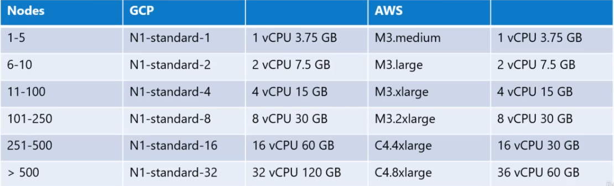
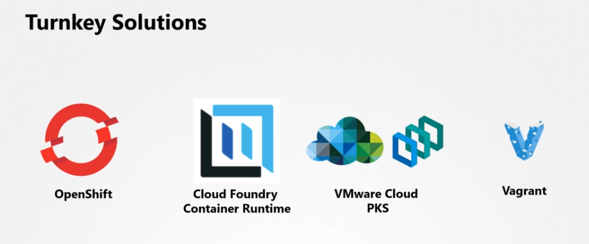
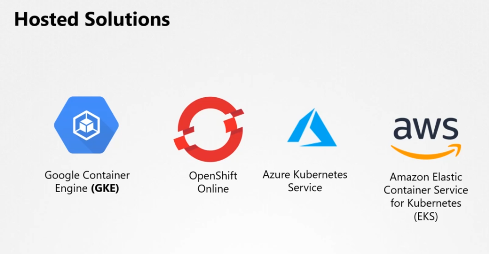
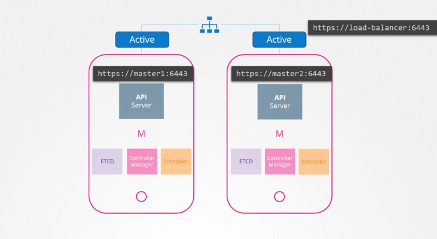
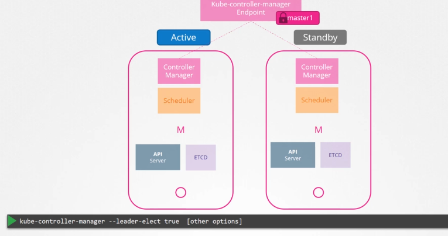
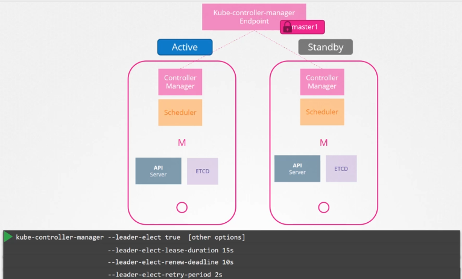
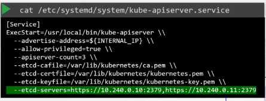
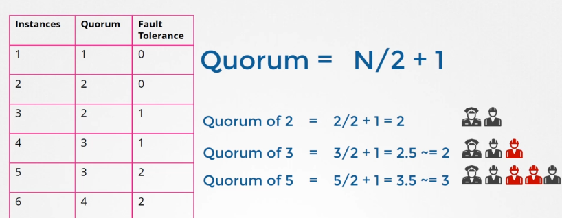
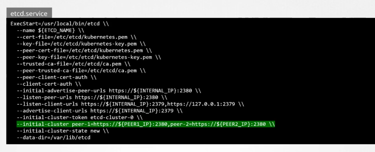

# Designing and install Kubernetes

before designing multiple questions should be answered regarding Purpose, cloud or onPrem considering the cost, and workload.

### purpose:

**Education, Development & testing, Hosting Production Application**

for **Education** pupose:
Minikube, or single node cluster with Kubeadm/GCP/AWS.

for **Development** and testing:
multi-node cluster with a single Master and multiple workers
Setting up Kubeadm tool or quick provision on GCP, AWS or AKS

for Hosting a **P** **roduction level application**, a highly available Multi-node cluster with multiple Master nodes
Using Kubeadm, GCP, or Kops on AWS, or Other supported Platform ( can be found on Kubernetes.io)

- Up to 5000 Nodes
- Up to 150,000 pods in the cluster
- Up to 300,000 Total Containers
- Up to 100 Pods Per node

### Cloud or onPrem:

you need to consider the availability of the cloud solution, the cost and, and what cloud provider to use ( this is based on so many factors live zones, data migration, etc..)

Kubeadm is a very usefull tool, Kops is a nice tool to provision Kubernetes on AWS, GKE for GCP makes provisioning with 1 click, last but not least Azure Kubernetes Service AKS for Azure, there are many other tools.

### workload:

How many applications?

what kind of application web, or big data/Analytics

what is the application Resource Requirements? (in terms of CPU and memory)

Traffic (Heavy or Burst)

* * *

- for High performance - SSD Backend Storage
- for Multiple concurrent Connections - Network Based Storage
- Persistent Shared volumes for shared access across multiple pods
- Label Nodes with Specific Disk Types
- Use Node Selectors to assign applications to nodes with specify disk types

Master Nodes can host workloads, but that is not recommended, and best practice is not to by placing a taint on the master node

you must use linux bit for Nodes

* * *

## Provision Kubernetes Cluster for Production Environment

### Turnkey Solutions

it's where you provision the VMs and the tools or scripts to deploy the Kubernetes Cluster.
at the end of the day, you are required to maintain those VMs, passing them, Upgrade them
an Example for that, Deploying Kubernetes on AWS Using KOPS Tool.

### Hosted Solutions

it's where the providers provide Kubernetes as a whole ( Kubernetes-As-A-Service) an Example GKE

## High Availability

redundancy of the Maser node provides a level of High availability that is required on some of the rapid production environments

### High availability in API-Server

from which known API Receives requests and they work a request at a time, so they can be alive and working as an active-active modes
Kube-apiserver listens at 6443 so which of the two (two for example) will listen to the request, and how to prevent the two of them listening to the same request?
before the level of the API Server, you can establish a load balancer to distribute the requests between the two API Servers and route them to the master nodes on port 6443

this load balancer can be nginx or ha-proxy or whatever

### Controller Manager and Scheduler

Controller consists of a set of Controllers like replication controller that watches the state of pods and take the necessary actions ( Creating a new pod, evicting pods, etc..)
if two of the replication controllers took action resulting more pods or less than required
same is true with scheduler, which schedule pods/containers to workload nodes

the two of them run in an active-standby mode.
when a controller manager process is configured you may specify leader election option set to true.

when this option is set to true a controller starts and then tries to get a lease of a lock from the **Kube-Controller-manager Endpoint** , whichever process gives the Endpoint its information, gains the lease and become the active of the two.
and hold the lease for &lt; lead-elect-lease-duration &gt; which is an option specified on the kube-controller options &lt; default 15 sec &gt;
the active process renew the lease every 10 seconds by &lt; leader-elect-renew-deadline &gt; option and both of the processes tries to gain the lease every 2 seconds, set by the &lt; leader-elect-retry-period &gt; 2 by default

that way if master process fails the other aquire the lease and becomes the leader

### HA in ETCD

with ETCD there are two topology that can be configured whithin the cluster

- Stacked Topology,
    where the ETCD is part of the Master node
    this is ( Easier to Setup, Easier to Manage, and costs fewer server but the **Risk During Failures is High**) that is because of if one master goes down both etcd is down and control plan instances are lost and redundancy is compromised
    
- Ecternal ETCD Server Topology
    the only advantage of this is that the ETCD Cluster is not tied to the control plane and if one of the master nodes go down the connection of the others are still valid to the etcd cluster
    

when looking at the API Server options, there is an option specifying where the ETCD Server is,as the api server is the only one that talks to the etcd server
ETCD is a distributed system, meaning when the api tries to talk to it ( Read/Write), it can reach any of its servers. and you need to make sure that the api is pointing to the right ip address of the etcd server

## ETCD HA in deep

**ETCD is a distributed key-value store that is simple, secure and fast.**

key-value store meaning that it keeps the data in forms of profiles or objective
while the retrieving of the key and value is simple, when the data gets big and there are so many records, it can be viewed as a json or yaml.

Distributed means that the data is the same on all the nodes of ETCD, which is called **Consistent** this is achieved.
in terms of reads it's not hard to understands as all the ETCD Nodes has the same data.
in case of the write, what actually happens is that they elect a leader which is responsible of processing and distributing the data within the leader node.
if the writes came from any of the other nodes they forward the writes to the leader internally and then the leader distributes the data by processing these writes. then the writes are considered complete when the leader gets consent from the other nodes in the cluster

### Leader election and Data Distribution in ETCD

The Leader election Process in ETCD is done using RAFT Protocol.
RAFT Algorithms generate a random timer on all the ETCD Nodes, after which the ETCD that finishes first sends a request for permission to be the leader to the other nodes and waits for the votes, and the node assumes the leader role, after it was elected as a leader, it sends out a regular notification to the other nodes that it is continuing to assume the role of the leader.
when the other nodes does not receive a notification of the leader, the nodes initiates a re-election process.

Going back to the writes, the leader duplicates the data/writes that it process, and recieves a consint from the nodes that they recieved the write.
the ETCD Cluster is highly available meaning that it will function even if one of the nodes are not responding, and the ETCD Continue to recieve and process write when the majority of the nodes are functioning, that means incase of three two can work. a write considered to be complete if it can be written to the majority of the cluster.
it's ditermined by the Quorum

the option of &lt; initial-cluster &gt; is that where the ETCD knows that it's a part of a cluster

once the etcd binaries and certificate is setup and the ETCD Process is up, use the etcdctl utility to store and retreive data
etcdctl has two api versions (v2, v3) v2 is default, whether v3 has more options and usecases.
you can set the etcd to v3 by setting an environmental variable

`export ETCDCTL_API=3`
`etcdctl put name jhon` this comamnds puts in the etcd a key of name and value of john
`etcdctl get name` this retrieves data 
`etcdctl get / --prefix --keys-only` this retrieves all keys
