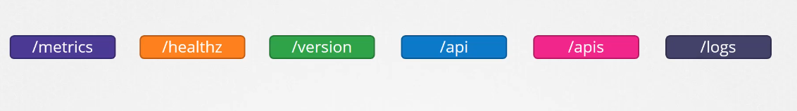
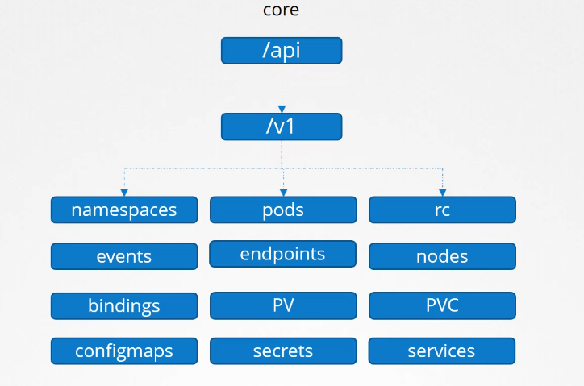
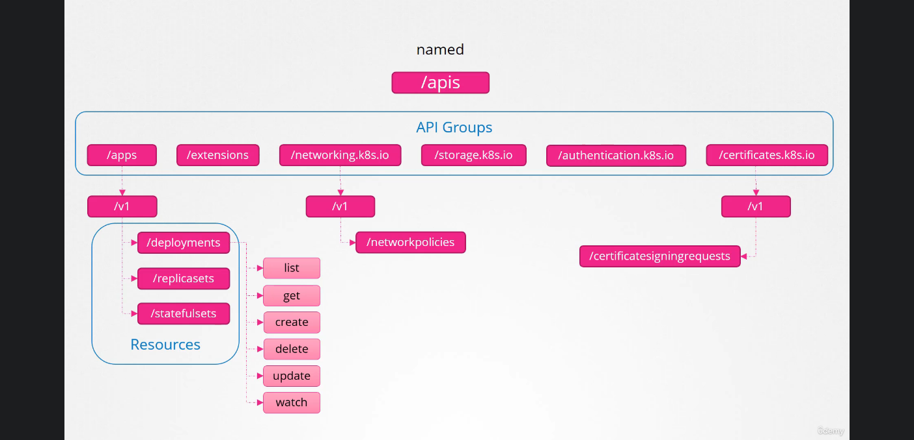

# API Groups



focusing on the api and apis groups, the api group is a core group



the named group apis are more organized, they are devided info groups and each group has it's resouces and it's associated actions



to show this using kurl in the minikube environement:

```BASH
curl https://192.168.59.100:8443/api \
--key /home/atta/.minikube/profiles/minikube/client.key \
--cert /home/atta/.minikube/profiles/minikube/client.crt  \
--cacert /home/atta/.minikube/ca.crt
```

## Kubectl proxy

it's a utility that launches a proxy on port 8001 and uses credentials and certificates from your config file to access the cluster 
`curl 127.0.0.1:8001` and the kubectl proxy will forward it to the cluster with all the credentials needed

### Important Note:

kube proxy is not Kubectl proxy
kube proxy is used to enable connectivity between all the pods and services across different nodes in the cluster
kubectl proxy is an http service created by the kubectl utility to access the kube-apiserver