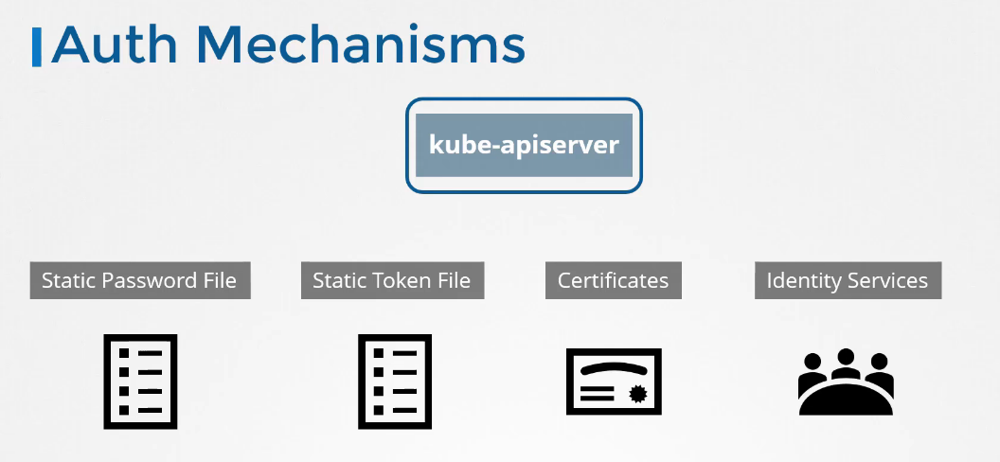
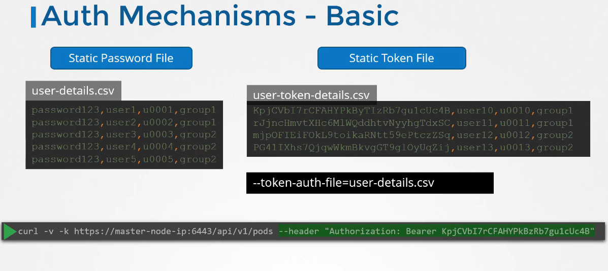

# Authentication

there are different users accessing the cluster, so every kind of users access the cluster for different porpuses, which means every kind needs different authorization and authentication

\- Administrators    - Developers    -Application End Users     - 3rd party for integration

the end users use the application throughout the urls available, so we are left with 2 kind of users:

Users: administrators and Developers, Service Accounts: which are 3rd party integrators and bots.

* * *

## users can access the cluster throughout the API Server

either by kubectl or by an api request for example curl (curl https://kube-apiserver:6443), the kubeapi authenticate the request before processing it.

you can authenticate using several mechanisms:



1- a static file containing usernames and passwords.

2- file containing usernames and tokens 

3- certificates

4- 3rd party identity service like LDAP or Kurborous 

* * *

### Using a Static File or a token file:

you can specify users in a csv file and pass that file to the kube-apiserver in the configuration section in the pod

`--basic-auth-file=user-details.csv`

you can edit the current kube-apiserver or modify the pod definition file in `/etc/kubernetes/manifests/kube-apiserver.yaml`

the kubeadm tool restarts the apiserver service once you update this file

after that it's ok to authenticate using a curl command like this 

`curl -v -k https://master-node-ip:6443/api/pods -u "user1:password123"`

the csv must conatain username, passwords, uid and can contain groupid

**using a token is similar, **instead of using the passwords as a plain test you write the token in csv file, and specify the option of the apiserver as **--toekn-auth-file=user-details.csv**

the important thing is when you try to curl you need to specify the authorization bearer like below



please note that 

#### Setup basic authentication on Kubernetes (Deprecated in 1.19)

* * *

## How to create the basic authentication in kubernetes:

Create a file with user details locally at `/tmp/users/user-details.csv`

```BASH
- # User File Contents
- password123,user1,u0001
- password123,user2,u0002
- password123,user3,u0003
- password123,user4,u0004
- password123,user5,u0005
```

Edit the kube-apiserver static pod configured by kubeadm to pass in the user details. The file is located at `/etc/kubernetes/manifests/kube-apiserver.yaml`

```YAML
- apiVersion: v1
- kind:  Pod
metadata:
  name: kube-apiserver
  namespace: kube-system
spec:
  containers:
  - command:
    - kube-apiserver
      <content-hidden>
    image: k8s.gcr.io/kube-apiserver-amd64:v1.11.3
    name: kube-apiserver
    volumeMounts:
    - mountPath:  /tmp/users
      name: usr-details
      readOnly:  true
    volumes:
    - hostPath:
        path:  /tmp/users
        type:  DirectoryOrCreate
      name: usr-details
```

Modify the kube-apiserver startup options to include the basic-auth file

```YAML
apiVersion: v1
    kind: Pod
    metadata:
      creationTimestamp: null
      name: kube-apiserver
      namespace: kube-system
    spec:
      containers:
      - command:
        - kube-apiserver
        - --authorization-mode=Node,RBAC
          <content-hidden>
        - --basic-auth-file=/tmp/users/user-details.csv
```

Create the necessary roles and role bindings for these users:

```YAML
---
    kind: Role
    apiVersion: rbac.authorization.k8s.io/v1
    metadata:
      namespace: default
      name: pod-reader
    rules:
    - apiGroups: [""] # "" indicates the core API group
      resources: ["pods"]
      verbs: ["get", "watch", "list"]
     
    ---
    # This role binding allows "jane" to read pods in the "default" namespace.
    kind: RoleBinding
    apiVersion: rbac.authorization.k8s.io/v1
    metadata:
      name: read-pods
      namespace: default
    subjects:
    - kind: User
      name: user1 # Name is case sensitive
      apiGroup: rbac.authorization.k8s.io
    roleRef:
      kind: Role #this must be Role or ClusterRole
      name: pod-reader # this must match the name of the Role or ClusterRole you wish to bind to
      apiGroup: rbac.authorization.k8s.io
```

Once created, you may authenticate into the kube-api server using the users credentials

`curl -v -k https://localhost:6443/api/v1/pods -u "user1:password123"`