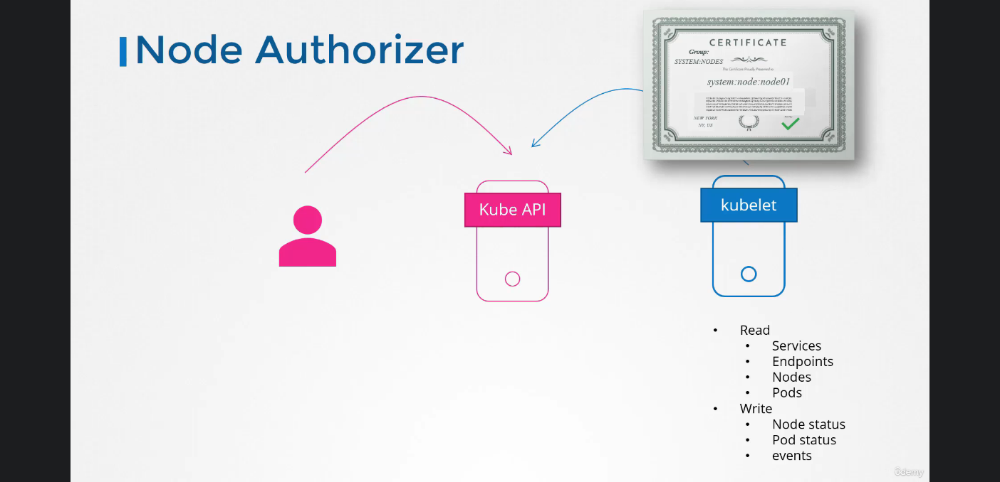
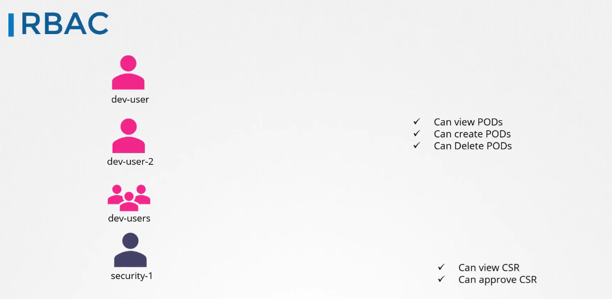
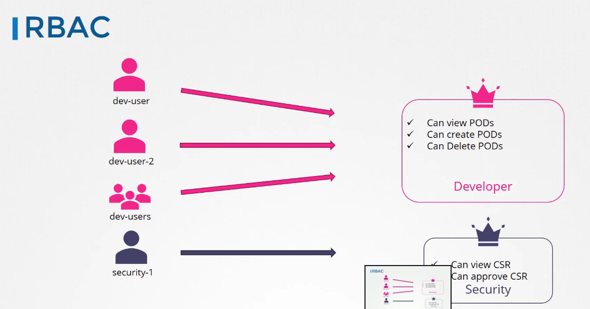
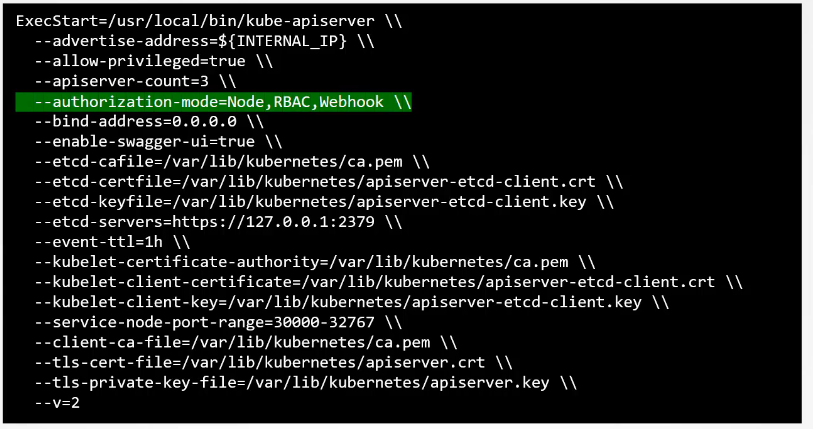
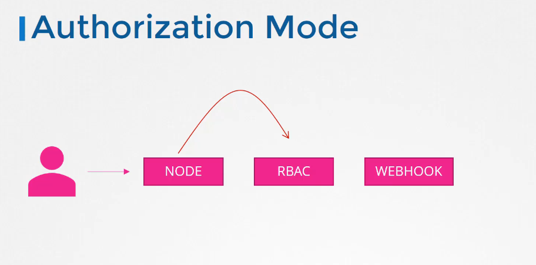

# Authorization

authorization is made to grant access to whom needs it but with minimum level of access needed rule.

## Authorization mechanisms

### 1- Node Authorizations

the kubelet acceses the apiserver to read stuff and write the node stuff, theses requests are handled by a special authorizor known as the node authorize.
in the kubelet certificate nodes where defined by system:node:node01 meaning that they are part of syste:node group which means that they are authorized by the node authorizor and granted these previlidges

### 2- Attribute Based Access control

in this mechanism you grant access to the users with the wanted actions such as view create or delete pods.
this is done by creating a policy file and stating the access in it in a json format, similarly you add every single user to the policy and restart the kube-apiserver

### 3- Role based access controls

it makes the granting much easier
instead of associating a user, a role is defined, like a role of developer, or a role of security, or admin, etc.
after that assign the role to the user and vwalah he has acces, if anytime the access of developers needs modifying we simply modify the role.

### 4- Webhook

this is a way to outsource the authorization mechanism, an example is open policy agent is a tool that helps managing the authorization for you.

### 5- always allow

### 6- always deny

## How to configure these modes

it's configured in the configurations of the kube-apiserver and option of
`--authorization-mode=Always allow #this is the default value`
or you can provide a comma separated list of the modes you want to use, 

in this case there is some sorting to use the modes as follows.
when you use multiple modes, your request is authorized by each mode in order, meaning that in this case, it will be authorized first by Node Authorizor, after failing it will go on to the next in the list RBAC once it gain access it will stop the authorization and grant the access at any level (order of the modes)

