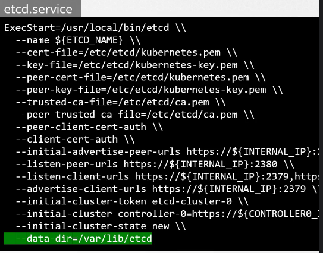
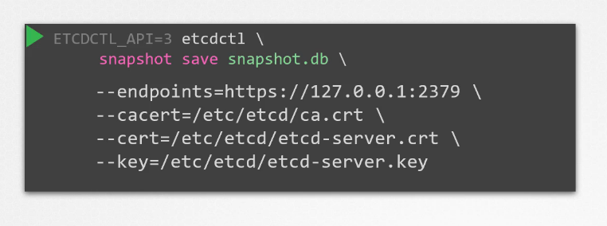
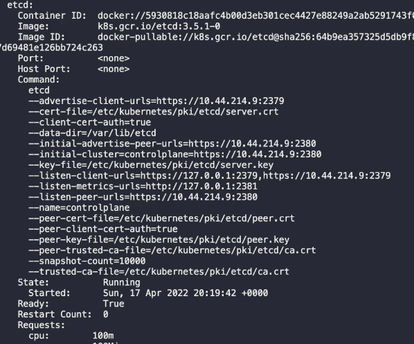

# Backup and Upgrade

there are 3 backup candidates to make:

1- Resource configuration files:

it's preferred to use object definition files to make a backup for these files incase something went wrong, a good practice is to save these configurations in a source code repo that way it could be maintained by a team, and it should be configured with the right backup solution

you can extract all the definition files:

`kubectl get all --all-namespaces -o yaml > all-deploy-services.yaml`

there are solutions like VELERO that takes a backup

2- all the cluster data in ETCD

the etcd stores data related to the status of the cluster, the file that contains the etcd data is well defined by the etcd.service, and that is the file to be backed up.

data-dir=/var/lib/etcd

etcd also comes with it's own snapshot solution, you can take a snapshot by the etcdctl command

`ETCDCTL_API=3 etcdctl snapshot save /tmp/snapshot.db`
`ETCDCTL_API=3 etcdctl snapshot status `

to restore:

`service kube-apiserver stop`

`ETCD_API=3 etcdctl snapshot restore snapshot.db --data-dir=/var/lib/etcd-from-backup`

when you restore a backup a new etcd cluster configurations with the new members are created, that is to prevent any new object from joining the cluster again (duplication) so the new data dir from before is created.

`systemctl daemon-reload`

`service etcd restart`

`service kube-apiserver start`

note: it's important to specify the certificates.

Since our ETCD database is TLS-Enabled, the following options are mandatory:

`--cacert` verify certificates of TLS-enabled secure servers using this CA bundle

`--cert` identify secure client using this TLS certificate file

`--endpoints=[127.0.0.1:2379]` This is the default as ETCD is running on master node and exposed on localhost 2379.

`--key` identify secure client using this TLS key file

after the backup you need the mount point to be at the new path you specified during the backup (during the snapshot taking)

* * *

## ETCD Version and directories

1- etcd version is known from the static pod describtion

`kubectl describe -n kube-system pod etcd-controlplane`

\- to get the version, see the image k8s.grc.io/etcd:3.5.1-0

\- to get the listening port listen-client-urls=https://127.0.0.1:2379

\- all the certificates are listed also

https://kubernetes.io/docs/tasks/administer-cluster/configure-upgrade-etcd/#backing-up-an-etcd-cluster

https://github.com/etcd-io/website/blob/main/content/en/docs/v3.5/op-guide/recovery.md

https://www.youtube.com/watch?v=qRPNuT080Hk