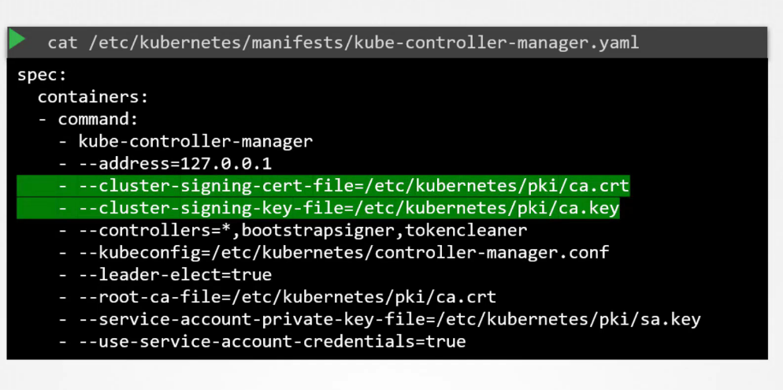

# Certificate API

There is a way to make the signing automated by the admins and the ca, that is by the CertificateSigningObject.yaml then the requests is viewed by the admin, and then approved, and then share the certificate with the user

the steps:
1- User to create the Key `openssl genrsa -out ahmed.key 2048`
2- create the signing request CSR `openssl req -new -key ahmed.key -subj "/CN=ahmed" -out ahmed.csr` and send it to the administrator
3- the administrator then creates the CertificateSigningRequest Object in a yaml file specifying the groups, usages of the account as a list of strings, the request field is where the you put the csr but **encoded** base64

```YAML
apiVersion: certificates.k8s.io/v1
kind: CertificateSigningRequest
metadata:
  name: atta
spec:
  request: LS0tLS1CRUdJTiBDRVJUSUZJQ0FURSBSRVFVRVNULS0tLS0KTUlJQ1ZqQ0NBVDRDQVFBd0VURVBNQTBHQTFVRUF3d0dZVzVuWld4aE1JSUJJakFOQmdrcWhraUc5dzBCQVFFRgpBQU9DQVE4QU1JSUJDZ0tDQVFFQTByczhJTHRHdTYxakx2dHhWTTJSVlRWMDNHWlJTWWw0dWluVWo4RElaWjBOCnR2MUZtRVFSd3VoaUZsOFEzcWl0Qm0wMUFSMkNJVXBGd2ZzSjZ4MXF3ckJzVkhZbGlBNVhwRVpZM3ExcGswSDQKM3Z3aGJlK1o2MVNrVHF5SVBYUUwrTWM5T1Nsbm0xb0R2N0NtSkZNMUlMRVI3QTVGZnZKOEdFRjJ6dHBoaUlFMwpub1dtdHNZb3JuT2wzc2lHQ2ZGZzR4Zmd4eW8ybmlneFNVekl1bXNnVm9PM2ttT0x1RVF6cXpkakJ3TFJXbWlECklmMXBMWnoyalVnald4UkhCM1gyWnVVV1d1T09PZnpXM01LaE8ybHEvZi9DdS8wYk83c0x0MCt3U2ZMSU91TFcKcW90blZtRmxMMytqTy82WDNDKzBERHk5aUtwbXJjVDBnWGZLemE1dHJRSURBUUFCb0FBd0RRWUpLb1pJaHZjTgpBUUVMQlFBRGdnRUJBR05WdmVIOGR4ZzNvK21VeVRkbmFjVmQ1N24zSkExdnZEU1JWREkyQTZ1eXN3ZFp1L1BVCkkwZXpZWFV0RVNnSk1IRmQycVVNMjNuNVJsSXJ3R0xuUXFISUh5VStWWHhsdnZsRnpNOVpEWllSTmU3QlJvYXgKQVlEdUI5STZXT3FYbkFvczFqRmxNUG5NbFpqdU5kSGxpT1BjTU1oNndLaTZzZFhpVStHYTJ2RUVLY01jSVUyRgpvU2djUWdMYTk0aEpacGk3ZnNMdm1OQUxoT045UHdNMGM1dVJVejV4T0dGMUtCbWRSeEgvbUNOS2JKYjFRQm1HCkkwYitEUEdaTktXTU0xMzhIQXdoV0tkNjVoVHdYOWl4V3ZHMkh4TG1WQzg0L1BHT0tWQW9FNkpsYWFHdTlQVmkKdjlOSjVaZlZrcXdCd0hKbzZXdk9xVlA3SVFjZmg3d0drWm89Ci0tLS0tRU5EIENFUlRJRklDQVRFIFJFUVVFU1QtLS0tLQo=
  signerName: kubernetes.io/kube-apiserver-client
  expirationSeconds: 86400  # one day
  usages:
  - digital signature
  - key encipherment
  - client auth
  groups:
  - system:authenticated
  - system:masters
```

4- certificate requests are seen by administrators `kubectl get csr` and approved by `kubectl certificate approve atta`
5- after that to get the certificate you query the certificate by `kubectl get csr atta -o yaml` the encoded format of the signed certificate is there and to decode it just `echo | base64 --decode`

* * *

## Controller Manager

the controller manager is the one responsible for approving and signing all the certificate, it has CSR-APPROVING and CSR-SIGNING



MIICVjCCAT4CAQAwETEPMA0GA1UEAwwGYWtzaGF5MIIBIjANBgkqhkiG9w0BAQEFAAOCAQ8AMIIBCgKCAQEAr40hkfjXxl5DIl3Jw0ANaAcRhL0lmjgmDyDjqN4w9W7X6yhDQ1jdTIE1ePhZz9XGX3PsrBN7FTzIlLTpsqhFL6UhthGB8S5vqUKxBmTXetEDtwRrAxnYgJPsqFYzzzgEfrLgUsqhFwuVi6Z/YvDiGg3nQbHuixaI88Y/SCOtaby1G0QLZUK9J1kshG/F6F+qU7NDsx5uTMbOMZXFjbGYE5mYFJQCfP1maS2Ry1c+Va4eqQzAe650A1+rkjNubGVIxqW63mFF3AS3DaXtk7TnCuD+SYfrwZFI6xUTRDWwinSwiGtWCLHvB3rjloRKb/U6UYRzkaDl5TIgaTyR7sM2bwIDAQABoAAwDQYJKoZIhvcNAQELBQADggEBAD72v0FNM5V/5PgJIOY4fi4/GkWyLfCFVbDkPjYyI6KKgvGwE6bAAhfYHt7DayAUYpvqOMR31okvvzCO3Bjg964XmiokhcgMmRWOCWxl0GkfshzrguxnW/1Es2Lb7dxa97a+dTEuVU4EqvMrrY8mo3wrlMAh365b2xEisCEVfsHXBlWRPjFRuw14HyFOi0JYERX8aeQXlPfCf61a8ktDou2fj+9OjosdF9MGaXEopQl9ERthUq0A8vShby7WyRZuIt3UeSMHdhTGV2q9MNM5KSHXWoI8wfvx+4S9F3tiGV2SZo3NLlTU+8SCzFLOHnGfNqYNF/MdgvAuchIcCu36kuE=