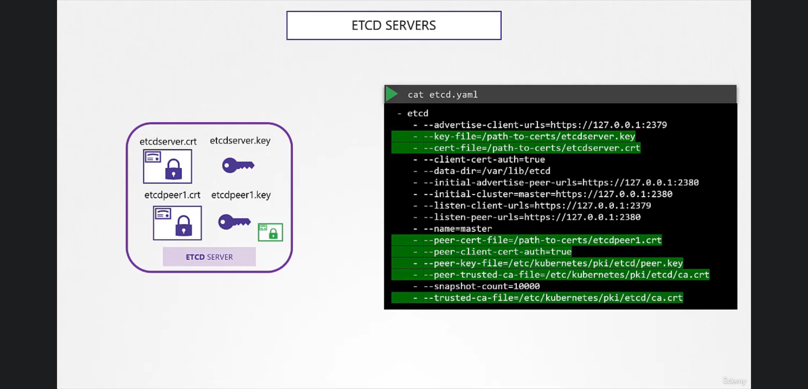
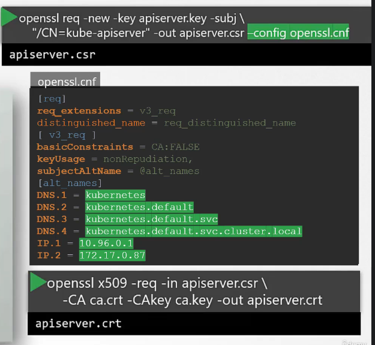
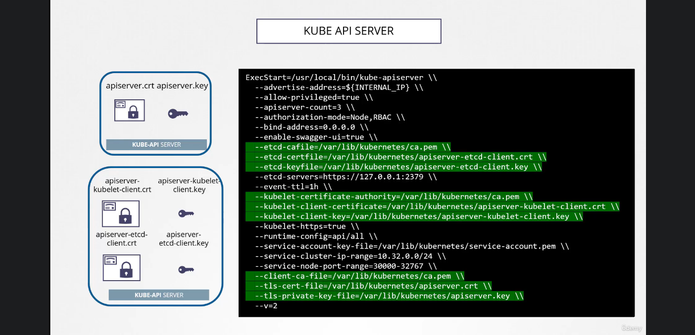
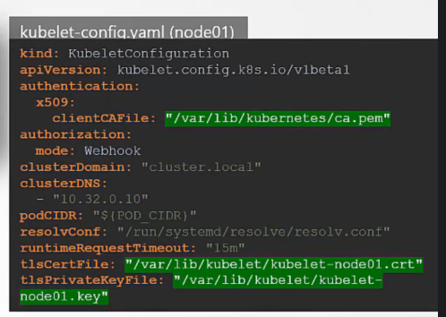

# Certificate Creation in Kubernetes

the first Certificate that needs to be created is the ca certificate, which will be used to sign all other certificates in the cluster, we will even use it to sign itself

### CA Certificate Creation:

1- create the key

`openssl genrsa -out ca.key 2048 `

2- create the signing request

`openssl req -new -key ca.key -subj "/CN=KUBERNETES-CA" -out ca.csr`

3- generate the public certificate signed by the signing request generated in the previous command

`openssl x509 -req -in ca.csr -signkey ca.key -out ca.crt #this is the root certificate file `

* * *

### Admin user

1- create the key

`openssl genrsa -out admin.key 2048 `

2- create the signing request

`openssl req -new -key admin.key -subj "/CN=kube-admin/O=system:masters" -out admin.csr`

the O is referring to groups, and this is used to differentiate between users

3- generate the public certificate signed by the ca

`openssl x509 -req -in admin.csr -CA ca.crt -CAkey ca.key -out admin.crt`

* * *

### Scheduler

1- create the key

`openssl genrsa -out scheduler.key 2048 `

2- create the signing request

`openssl req -new -key scheduler.key -subj "/CN=SYSTEM:KUBE-SCHEDULER" -out scheduler.csr`

3- generate the public certificate signed by the ca

`openssl x509 -req -in scheduler.csr -CA ca.crt -CAkey ca.key -out scheduler.cert -out scheduler.crt`

* * *

### Kube-Controller-Manager

1- create the key

`openssl genrsa -out controller-manager.key 2048 `

2- create the signing request

`openssl req -new -key controller-manager.key -subj "/CN=SYSTEM:KUBE-CONTROLLER-MANAGER" -out controller-manager.csr`

3- generate the public certificate signed by the ca

`openssl x509 -req -in controller-manager.csr -CA ca.crt -CAkey ca.key -out controller-manager.cert -out controller-manager.crt`

* * *

### Kube-proxy

1- create the key

`openssl genrsa -out kube-proxy.key 2048 `

2- create the signing request

`openssl req -new -key kube-proxy.key -subj "/CN=SYSTEM:KUBE-PROXY" -out kube-proxy.csr`

3- generate the public certificate signed by the ca

`openssl x509 -req -in kube-proxy.csr -CA ca.crt -CAkey ca.key -out kube-proxy.cert -out kube-proxy.crt`

* * *

### ETCD Server

in case of ETCD Server, there are the feasibility to make a multiple ETCD Server for high availability cluster, in that method, you create the signed certificate of each server and it's called **peer** certificate

* * *

### Kube API Server

in this case we need to create a config file for the configurations of the API Server certificate as they are alot.

so an **openssl.conf** file is created and passed to the openssl command while creating the certificate request CSR and then we can create the certificate crt file.

the openssl file is needed for the many names that components of Kubernetes call the API Server with.

and similarly to ETCD in the kube-apiserver.service we need to specify all the pathes to all the certificate

* * *

### Kubelet

the kubelet certificates are named after their nodes and the configuration file containing the path is the kubelet-config.yaml file

the Kubelet Client certificate to communicate with the api server, and scince it's related to the system they are named system:node:node01/&lt;nodename&gt;

not just that,  how would the api give it the right set of permissions? as a nodes, it must be in the groups of the nodes: SYSTEM:NODES