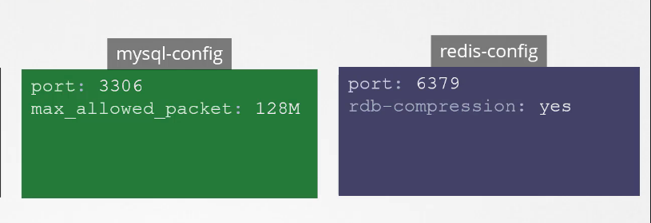

# configMaps

when the environmental variables increase it would be extremely hard to write it down in every definition file made, so configMaps were used to exclude the environmental variables and configurations from the definition file and only refer back to it when needed in the definition files

### How does it go?

config maps are creating by writing the key/value pairs in it, and then inject the configMaps into the pods needed

`kubectl create configmap <config-name> --from-literal=<key1>=<value1> --from-literal=<key2>=<value2>` --\> imperative

`kubectl create configmap app-config --from-literal=COLOR=BLUE --from-literal=COLOR2=BLUE2`

`kubectl create configmap <config-name> --from-file=<file-path>`

`kubectl create configmap <config-name> --from-file=app-config.properties`

`kube create -f configmap.yaml` --\> declarative way

```YAML
apiVersion: v1
kind: ConfigMap
metadata:
  creationTimestamp: null
  name: app-config
data:
  COLOR: BLUE
  COLOR2: BLUE2
```

examples for the Data:



it's important to choose configMaps names as they will be used later on with the pods needed

`kubectl get configmaps`

`kubectl describe configmap`

## configMaps in pods Definition file

```YAML
spec:
  containers:
  - name: container1
    image: image-url
    ports:
    - containerPort: 8080
    envFrom:
    - configMapRef:
      name: app-config #this is the configMap that was created earlier
    restartPolicy: Never
```

### other use cases to configMaps

**single env:**

you can extract 1 env from the configMap and use it in a pod definition file

```YAML
spec:
  containers
  - name:
    image:
    env:
    - name: APP_COLOR
      valueFrom:
        configMapRef:
         name: app-config
         key: APP_COLOR
```

**volumes:**

last but not least it's used in the volumes

```YAML
spec:
  containers:
    volumes:
    - name: app-volume
      configMap:
        name: app-config
```