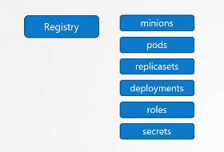

# ETCD

## what is a key-value store?

it's different from the relational database that is stores the data as a key value format, you provides the key and it returns the value, so you can't have a duplicate key, so it's used to to store data that needs to be handed quickly and it's not using big chunks of data

it's easy to install the ETCD, download the binaries and extract them and run, from the github release pages.

when you run the ETCD service it listens on 2379 then you can attach any client to store and retreive information, the default client that comes with etcd is the etcd control client (etcdctl is a command line client for etcd used to store and retreive key value pairs )

an example: `./etcdctl set key1 value1` and to restore it `./etcdctl get key1`

and to view more options just run `./etcdctl `

ETCD Cluster holds (Nodes, PODs, Configes, Secrets, Accounts, Roles, Bindings, Others), and every information you run by kubectl command is from the etcd server, every change like adding nodes, replica sets are updated to etc server

Depending on how you set up your cluster, etcd is setup differently

etcd listens on port **2379**, and the binary item is \*\*advertise-client-urls, \*\*that if you install the cluster manually. If you set up the kubeadm it installs and configures the etcd as a pod (etcd master) you can use the etcctl within this pod.

to list all the keys in the etcd `etcdctl get / --prefix -keys-only`

kubernetes stores data in a specific directory structure, the root is registry and under it you have the many kubernetes constructs.

in a HA you will have multiple nodes, with multiple etcd, in that case you need to make sure that ETCDs know about each other by setting the right parameters, which are `initial-cluster controller-0=<> controller-1=<>`

(Optional) Additional information about ETCDCTL Utility
ETCDCTL is the CLI tool used to interact with ETCD.
ETCDCTL can interact with ETCD Server using 2 API versions - Version 2 and Version 3. By default its set to use Version 2. Each version has different sets of commands.

For example ETCDCTL version 2 supports the following commands:

1.  `etcdctl backup`
2.  `etcdctl cluster-health`
3.  `etcdctl mk`
4.  `etcdctl mkdir`
5.  `etcdctl set`

Whereas the commands are different in version 3

1.  `etcdctl snapshot save`
2.  `etcdctl endpoint health`
3.  `etcdctl get`
4.  `etcdctl put`

To set the right version of API set the environment variable ETCDCTL_API command

`export ETCDCTL_API=3`

When API version is not set, it is assumed to be set to version 2. And version 3 commands listed above don't work. When API version is set to version 3, version 2 commands listed above don't work.

Apart from that, you must also specify path to certificate files so that ETCDCTL can authenticate to the ETCD API Server. The certificate files are available in the etcd-master at the following path. We discuss more about certificates in the security section of this course. So don't worry if this looks complex:

1.  `--cacert /etc/kubernetes/pki/etcd/ca.crt`
2.  `--cert /etc/kubernetes/pki/etcd/server.crt`
3.  `--key /etc/kubernetes/pki/etcd/server.key`

So for the commands I showed in the previous video to work you must specify the ETCDCTL API version and path to certificate files. Below is the final form:

1.  `kubectl exec etcd-master -n kube-system -- sh -c "ETCDCTL_API=3 etcdctl get / --prefix --keys-only --limit=10 --cacert /etc/kubernetes/pki/etcd/ca.crt --cert /etc/kubernetes/pki/etcd/server.crt --key /etc/kubernetes/pki/etcd/server.key"`