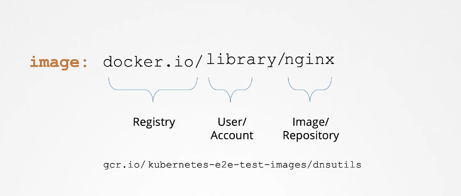

# Image Security

when you write the name of the image and run it to start the pod, like for example nginx, it actualy refers to docker.io/library/nginx

docker.io is the registry that contains alot of docker images, while library is the account or user name and nginx is the image name, this is assumed by default when specifying nginx.

another registry to be used is google registry gcr.io



when you need to hide your images from the public you host it in a private registry ( can be on docker/google/aws/on your machine) that private registry needs access using a set of credentials.
from docker perspective

`docker login private-registry.io` then write the credentials
`docker run private-registry.io/apps/internal-app`

in the kubernetes, a secret from the type of docker-registry is created to access the registry, it has all the credentials

`kubectl create secret docker-registry dockercfg \`
`--docker-server=private-registry.io \`
`--docker-username=registry-user \`
`--docker-password=password123 \`
`--docker-email=registry-user@domain.com`

and then associate the secret in the pod definition file with the full path to the image:

```YAML
apiVersion: v1
kind: Pod
metadata:
  name: nginx
spec:
 containers:
 - name: nginx
   image: private-registry.io/app/internal-app
 imagePullSecrets:
 - name: dockercfg
```