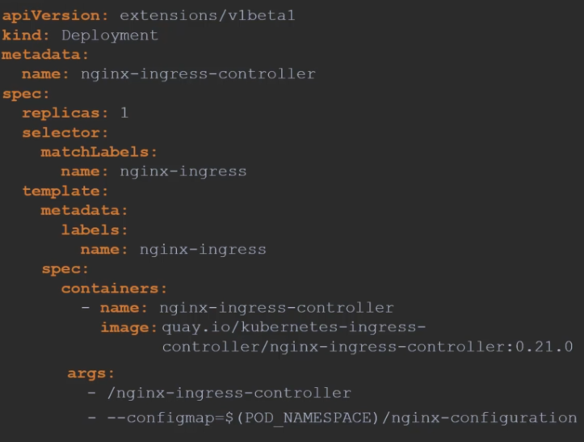
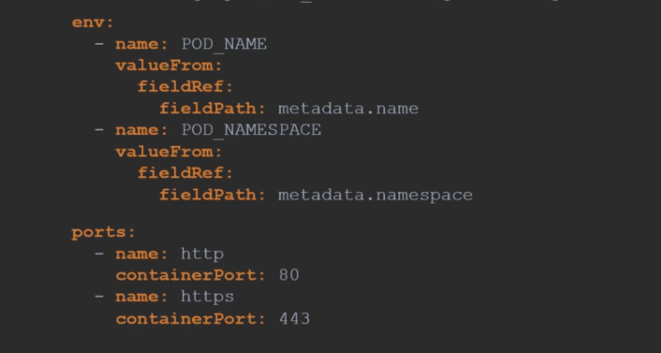
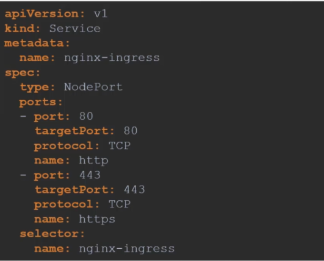
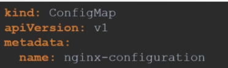
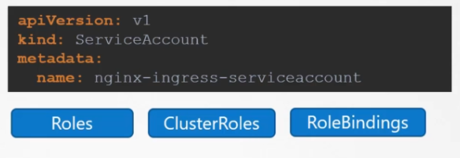
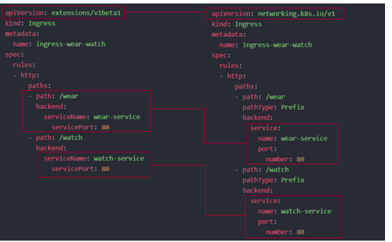

# Ingress

ingress is like a proxy that maps the traffic that comes from a user based on the path that they enter

the **Ingress controller** is a collection of Deployments, Services, configmaps and Service Accounts used to create and deploy the reverse proxy, and the kubernetes cluster does not come with an ingress controller by default, it's not just the proxy or load balancer, it has the intelegence to monitor the cluster for any modifications in the definintion files or ingress resources

and the **Ingress Resources** are the components/pathes which the user is route to

## A. Ingress Controller

### 1\. Reverse proxy Solution

the ingress controller must have a network reverse proxy solution like NGINX, HAPROXY, or google loadbalancer gce (cloud based), which is deployed as a deployment in cluster.

example for it

 

### 2\. Service

and it still needs a service to expose it to the incoming trafiic, which comes from the users/api.



### 3\. Configmap

the configurations for the network reverse proxy configurations, are stored in the configmap created for it, it can be edited or managed later with the new configurations

the configurations stored in the configmap can be ssl configurations, config files and config file pathes, keepalive thresholds, session timeouts, etc..



### 4\. ServiceAccount

to graint access and right permissions for the nginx for example to manage the traffic a service account is created with the right rules and rule bindings

this service account is mainly to monitor the definition file changes and ingress resources



## B. Ingress Resources

they are a set of configurations and rules applied to the ingress controller, and there are multiple types of rules that can be applied on the traffic, or a combination of these types:

## 1- forward rule only

```YAML
apiVersion: networking.k8s.io/v1
kind: Ingress
metadata:
  name: ingress-wear
spec:
  backend:
    service:
      name: wear-service
      port:
        number: 80
```

### 2-Rule Based Ingress



### 3- Rule and Host Based Ingress

it's as shown below every rule is for a Host, and the host can contain multiple pathes.

```YAML
apiVersion: networking.k8s.io/v1
kind: Ingress
metadata:
  name: ingress-wildcard-host
spec:
  rules:
  - host: "foo.bar.com"
    http:
      paths:
      - pathType: Prefix
        path: "/bar"
        backend:
          service:
            name: service1
            port:
              number: 80
  - host: "*.foo.com"
    http:
      paths:
      - pathType: Prefix
        path: "/foo"
        backend:
          service:
            name: service2
            port:
              number: 80
```

**Format - `kubectl create ingress <ingress-name> --rule="host/path=service:port"`**

**Example - `kubectl create ingress ingress-test --rule="wear.my-online-store.com/wear`*`=wear-service:80"`*