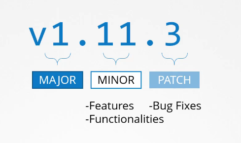
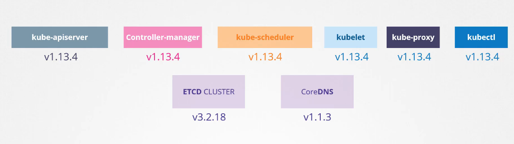

# Kubernetes Versions

release version consists of 3 parts

v1.11.3 for Example

the first major version was released at July 2015

also there are alpha and beta releases:

\- **alpha**: in this version the features are disabled by default and maybe buggy

\- **beta: **the code is well tested and the features are enabled by default, but it could have some bugs also

after that they make their way to the main stable release

the kubernetes package are found on the github page, and the package has all the control plane components in it,

**Note that **there are other components that does not have the same version number.

any seperate projects have their own version numbers 

https://kubernetes.io/docs/concepts/overview/kubernetes-api/

Here is a link to kubernetes documentation if you want to learn more about this topic (You don't need it for the exam though):

https://github.com/kubernetes/community/blob/master/contributors/devel/sig-architecture/api-conventions.md

https://github.com/kubernetes/community/blob/master/contributors/devel/sig-architecture/api_changes.md