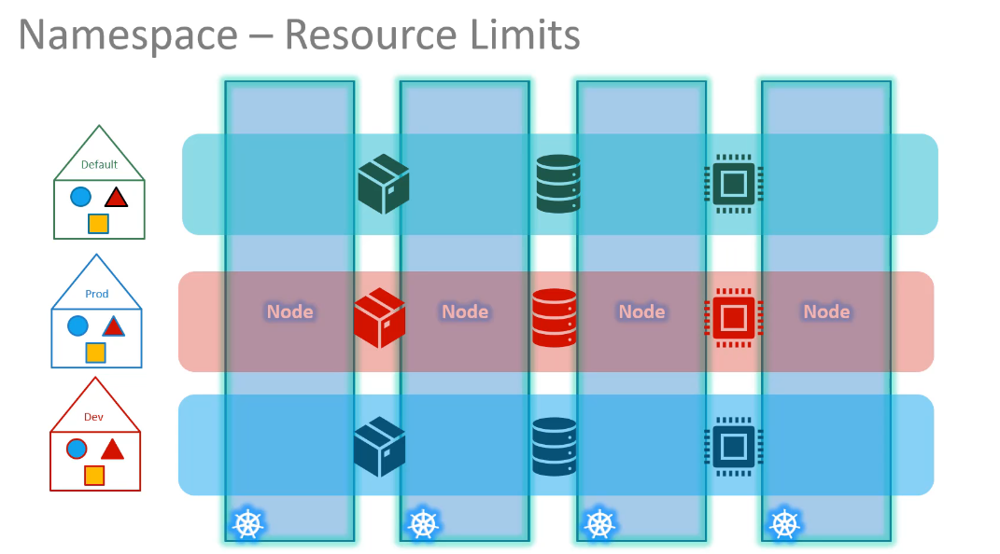
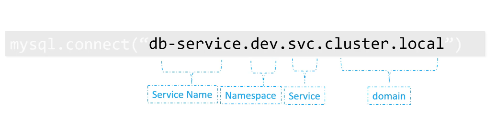

# Name Spaces

Name spaces are like a group of objects and resources gathered together

the namespace used by the user is call **Default namespace**

the **kube-system namespace** is the one that have the system pods

the **kube-public namespace** it has all the resources that should be available for all users

the use of namespaces emerges when you are inside an Enterprise or a big business, otherwise when the environment is small or setting up kubernetes for playing, there is no need for namespaces, so the main purpose of namespaces is **isolation of both objects and resources**.

## Namespaces-resource Limitations.

each namespace has it's own set of policies that allocates resources for this namespace even if they are distributed between nodes.



to define a resource that is not in the same namespace you need to define all the aspects, and provide a full resolution name, an example for a service:



`kubectl get pods --namespace=kube-system`

`kubectl create -f pod.yaml --namespace=dev`

name space can be added to the definition file (manifest) in the metadata section.

```YAML
metadata:
    name: myapp-pod
    namespace: dev
    labels:
        app: myapp
```

## Create a Namespace

`kubectl create namespace dev`

or in a yaml file:

```YAML
apiVersion: v1
kine: Namespace
metadata:
  name: dev
```

## switch the default namespace

this command would switch the default name space to what you want for example dev

`kubectl config set-context $(kubectl config current-context) --namespace=dev`

in this case to list the pods in the default namespace: `kubectl get pods --namespace=default`