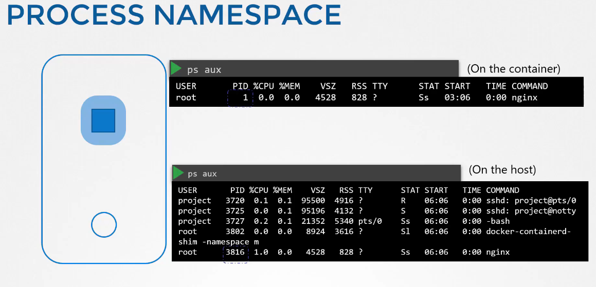
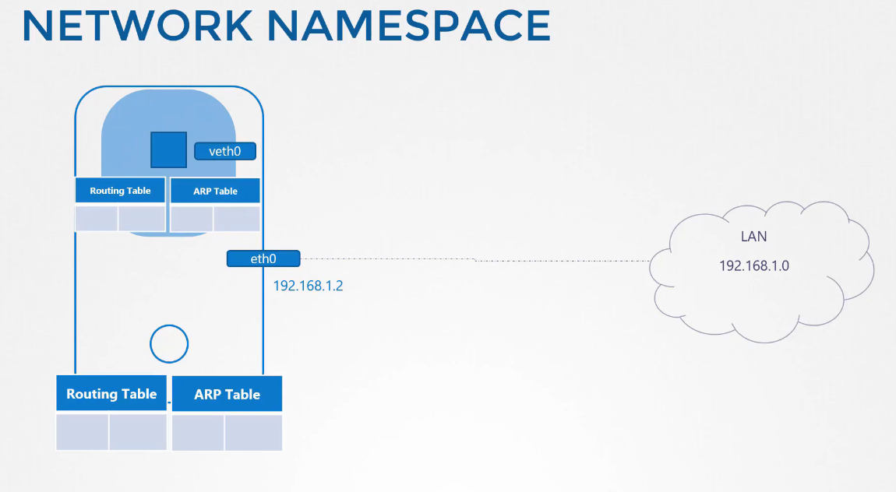
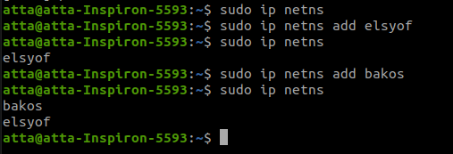
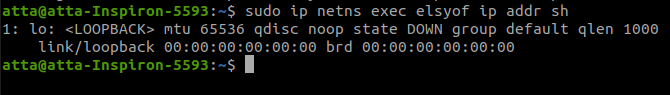

# NameSpaces

namespaces are used to isolate the docker containers, or the processes inside the container, when you run the ps command you will find the process running on the container with it's PID, and if you run the same command from within the container, the PID will be different, that is how namespaces work

the container in the namespace is isolated from the network perspective, never the less the container within the namespace can have it's own virtual interfaces, routing and arp tables.

to add new namespaces `ip netns add <ns-name>`

and to exec a command within the namespace `sudo ip netns exec <ns-name> ip addr sh` or `ip -n <ns-name> add sh`

and to link the two name spaces together

`sudo ip netns exec elsyof ip addr sh ` show the network

`sudo ip link add veth-red type veth peer name veth-blue` make the virtual pipe 

`sudo ip link set veth-red netns elsyof` attach the virtual interfaces to the namespaces

`sudo ip link veth-blue netns bakos`

`sudo ip -n elsyof addr add 192.168.15.1/24 dev veth-red` add the ips to the interfaces

`sudo ip -n bakos addr add 192.168.15.2/24 dev veth-blue`

`sudo ip netns exec elsyof ping 192.168.15.2`

`sudo ip netns exec elsyof arp -a`

to connect multiple namespaces together inside a linux host, you use virtual switch, there are multiple solutions that provides multiple solutions like linux bridge which i'll use:

`sudo ip link add v-net-0 type bridge` first you create the virtual connection set to bridge connection