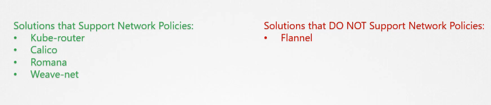

# Network policies

the difference between ingress and egress traffic is that ingress in startling is coming from outside


in this photo the api server has an ingress from the web server at port 5000, and has egress at port 3306, rules and traffic are determined this way


the default setup in kubernetes is that any pod can reach any pod inside the same cluster, and to block traffic between pods you can establish a network policy to block the traffic between for example web server and DB. and only allow traffic to the db pod ingress traffic from API server on port 80.

network policies are objects like pods and deployments, that can be applied on one or more pods using labels and selectors (just like deployments and replicasets).

when you write down your rules, you need to specify whether to accept ingress, Egress or both

```YAML
apiVersion: networking.k8s.io/v1
kind: NetworkPolicy
metadata:
  name: test-network-policy
  namespace: default
spec:
  podSelector:
    matchLabels:
      role: db # this is where you put the pod that the policy will be applied on
  policyTypes:
    - Ingress
    - Egress
  ingress:
    - from:
        - ipBlock:
            cidr: 172.17.0.0/16
            except:
              - 172.17.1.0/24
        - namespaceSelector:
            matchLabels:
              project: myproject
        - podSelector:
            matchLabels:
              role: frontend # this is the pod that passes traffic to our on-policy pods
      ports:
        - protocol: TCP
          port: 6379
  egress:
    - to:
        - ipBlock:
            cidr: 10.0.0.0/24
      ports:
        - protocol: TCP
          port: 5978
```

Note that the network policies are enforced by the network solutions that are implemented on the cluster



In this example please note that the first section represents and selector, and the ip with that means or

