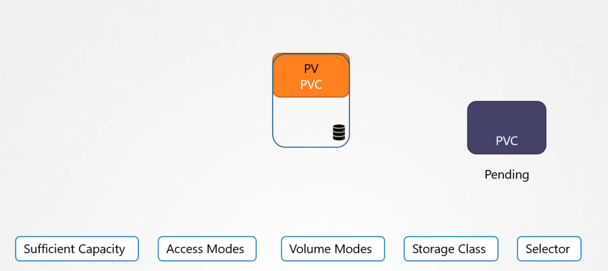

# Persistent Volumes and Persistent Volume claims

instead of creating the volumes within the pod definition file, but this will not be easy for each pod in large environment, everytime a change to be made, a user would make the change in all the pod definintion files.

## persistent volume

it is a cluster wide pool of sotrage volume configured by a admin to be used by users deploying applications, and users can use these persistent volumes using persistent volume claims

```YAML
apiVersion: v1
kind: persistentVolume
metadata:
  name: pv-vol1
spec:
  accessModes:
    - ReadWriteOnce # can be ReadOnlyMany ReadWriteOnce ReadWriteMany
  caoacity:
    storage: 1Gi
  hostPath:
    path: /tmp/data # note that this is not ok with cluster of multiple nodes
```

### [Access Modes](https://kubernetes.io/docs/concepts/storage/persistent-volumes/#access-modes)[](https://kubernetes.io/docs/concepts/storage/persistent-volumes/#access-modes)

A PersistentVolume can be mounted on a host in any way supported by the resource provider. As shown in the table below, providers will have different capabilities and each PV's access modes are set to the specific modes supported by that particular volume. For example, NFS can support multiple read/write clients, but a specific NFS PV might be exported on the server as read-only. Each PV gets its own set of access modes describing that specific PV's capabilities.

The access modes are:

`ReadWriteOnce`

the volume can be mounted as read-write by a single node. ReadWriteOnce access mode still can allow multiple pods to access the volume when the pods are running on the same node.

`ReadOnlyMany`

the volume can be mounted as read-only by many nodes.

`ReadWriteMany`

the volume can be mounted as read-write by many nodes.

`ReadWriteOncePod`

the volume can be mounted as read-write by a single Pod. Use ReadWriteOncePod access mode if you want to ensure that only one pod across whole cluster can read that PVC or write to it. This is only supported for CSI volumes and Kubernetes version 1.22+.

In the CLI, the access modes are abbreviated to:

- RWO - ReadWriteOnce
- ROX - ReadOnlyMany
- RWX - ReadWriteMany
- RWOP - ReadWriteOncePod

you can use it with external Vols like EBS, S3 etc.

```YAML
apiVersion: v1
kind: persistentVolume
metadata:
  name: pv-vol1
spec:
  accessModes:
    - ReadWriteOnce # can be ReadOnlyMany ReadWriteOnce ReadWriteMany
  caoacity:
    storage: 1Gi
  awsElasticBlockStore:
    volumeID: <volume-ID>
    fsType: ext4
```

## Persistent Volume Claims

it's made to make a storage available to a node

### Binding

an Administrator creates the volume, and the user creates a volume claim to calim this volume for use, every persistent volume claim is bond to a persistent volume, during the binding process Kubernetes tries to find a persistent volume that has suffecient capacity that will be used by the claim and any other request proberties such as access modes, volume modes, or storage class.

when there is multiple persistent volumes that match the persistent volume claim, you can still use labels to bind to the specific volume

```YAML
#PV
label:
  name: volume1
```

```YAML
#PVC
selectors:
  matchLabels:
    name: volume1
```

### No other claims other than 1 can be bound to a persistent volume

There is a 1 to 1 relationship between PV and PVC, and if these is no PVs that matches the cretiera for PVC other than a bound PV with another PVC the PVC remains in a pending state



```YAML
apiVersion: v1
kind: PersistentVolumeClaim
metadata:
  name: myclaim
spec:
  accessModes:
    - ReadWriteOnce
  resources:
    request:
      storage: 500mi
```

when you delete a persistent volume claim, what happen to the persistent volume can be set in the pvc, by default it's set to retain, meaning it's waiting for the admin to delete it and can't be used by other pvcs, also can choose recycle , which means the data on the volume will be scruped before making it available to other claims

```YAML
PersistentVolumeReclaimPolicy: Retain/Recycle/Delete
```