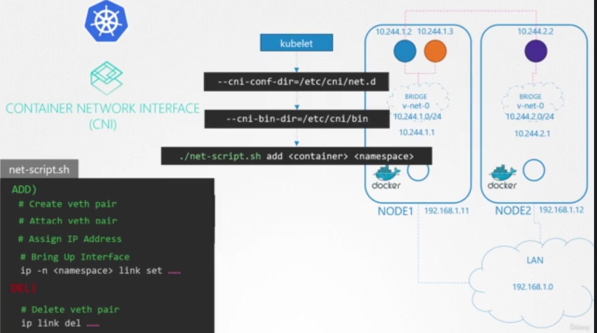

# Pod Networking

the networking on the pod layer in crucial and very important, and that is because every pod should be connected to other pod.

for that kubernetes stated that i's completely up to you to set up the network for the pods, and there are multiple solutions which help in solving this, however, there are some requirements that was sorted and cleared b kubernetes

after applying the previous commands of setting up a virtual switch and virtual links and interfaces, you can write them down as a script for the kubelet to use.

the kubelet on each node is responsible for creating the containers, whenever a container is created the kubelet looks at the option of the cni-conf-dir which is a command line arguement passed when the kubelet was run and identifies the script name, it then looks at the cni-bin-dir to find the script and then excutes the script with the add command and the name and namespace id of the container.