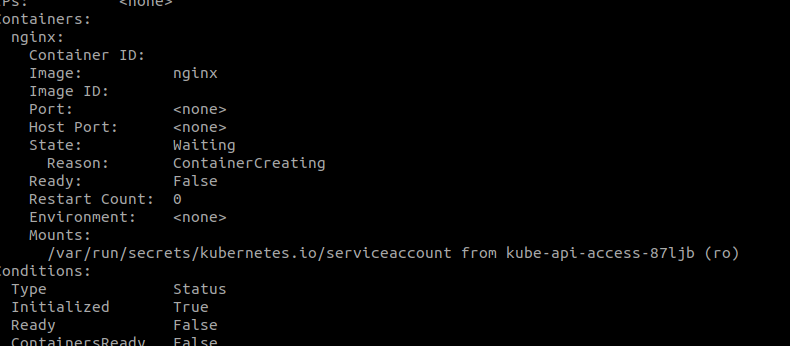

# Service Account

Service account is used to authenticate the 3rd party interations like for example Jenkins, Promethous, etc..
to view `kubectl get serviceaccounts`
to create `kubectl create sa jenkins`
when the service account is created it automatically creates a token which will be used by the 3rd party to authenticate with the kubernetes api
in this case the service account name will be **Jenkins-sa-token-kbbdm,** after that a secret is created to store the token, and then the secret is linked to the service account, and to view the token you run the command `kubectl describe secret Jenkins-sa-token-kbbdmb` this token can be used to authenticate with the api using curl bearer

`curl https://kube/api insecure --header "Authorization: Bearer <token>"`

don't forget that you need to establish the token in the external application,

### external application as a pod inside the kubernetes:

in case that the 3rd party external application is a pod inside the kubernetes cluster, then the token can be mounted via a volume inside the pod, and can be easily read, and you don't have to provide it manually

## Default service account

there is a default service account that is linked with any created pod in the default namespace which even if it's not listed in the definition file or the run command, it's still shown in the describe command containing the default service account as well as the token
it ca be shown in the describe
kubectl describe pod nginx



`k exec -it nginx -- ls /var/run/secrets/kubernetes.io/serviceaccount`
`k exec -it nginx -- cat /var/run/secrets/kubernetes.io/serviceaccount/token`

## using a service account with a pod

```YAML
apiVersion: v1
kind: Pod
metadata:
  creationTimestamp: null
  labels:
    run: nginx
  name: nginx
spec:
  containers:
  - image: nginx
    name: nginx
    resources: {}
  serviceAccountName: jenkins
  dnsPolicy: ClusterFirst
  restartPolicy: Always
status: {}
```

Important Node: you can't edit the pod with the new service account, it can be changed, you must delete the pod and recreate it, however, you can edit a deployment with a different service account