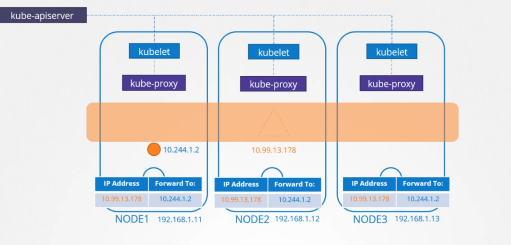
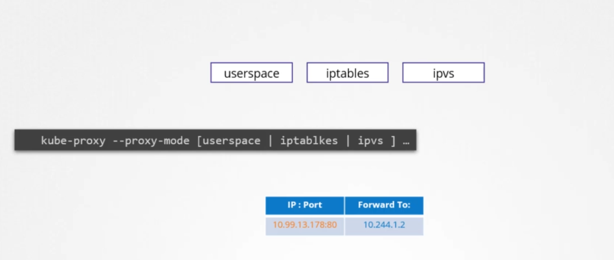
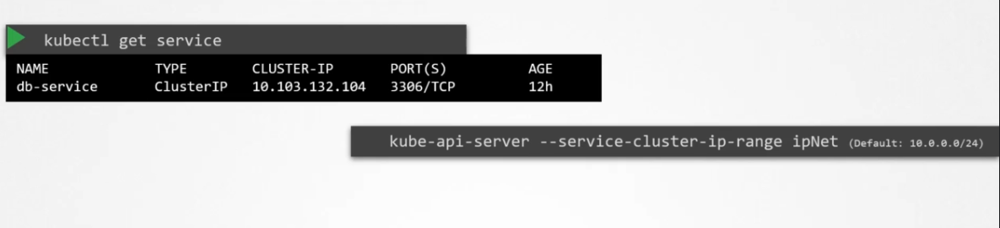
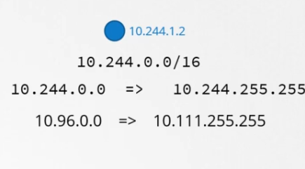

# Services Network

Services are pond to a pod to be accessible from any other pod through a ip address and a port. ( Cluster IP from inside the cluster and node port from outside even)

## KubeProxy

the KubeProxy is the one responsible for creating the service and

kubeproxy watches the changes through the api server, and every time a service is created the kubeproxy gets into action, unlike the pods it's not pond by a node like the pod, it's a cluster wide, as a matter of fact, they don't exist at all, there is no server or service that listens to the ip of the service.

when a service is created, it's assigned to a fixed range of ips, and kubeproxy running on each component, gets that ip address and creates forward rules, saying any traffic that comes from the IP of the service should go to the ip of the pods. and it's accessable throughout any node. Important note that it's not just an IP, it's an IP and port Compinations

## How Does KubeProxy Create the Forward Rules?

Kubeproxy uses different ways, like userspace where kubeproxy listens on a port for each service, or by connection to the pods by ipvs, and lastly by using iptables (default).

the proxy mode is defined when creating the kubeproxy as an option, and if not defined it's default is iptables

the  range of the cluster ip service is set from the following option:

the range of the service should not overlap with the pod networking which can default is 10.244..0.0/16

following is an example:

you can see the iptables rules from `iptables -L -t nat | grep db-service`

or from the kubeproxy log file cat /var/log/kube-proxy.log