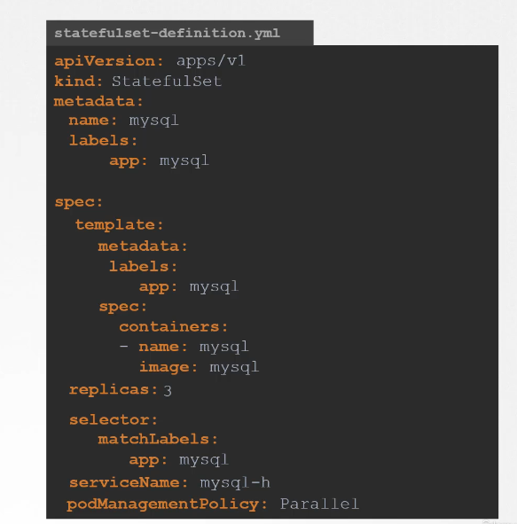

# Stateful Sets

they are similar to the deployment Sets, they create pods and scale up and rolling updates and roll backs, but the main difference is that stateful sets, pods are created in a sequential order. after the first pod is deployed the second one is not deployed before it's running.

stateful sets assign a unique original index to each pod, from (0--last) each pod gets a unique name drived from this index compined with the stateful set name the first pod for example mysql-0 and second mysql-1

the pod management policy field can be made parallel to make the stateful set not follow an ordered approach and remove the graceful creation, that is to benifit from the other uses of the stateful sets