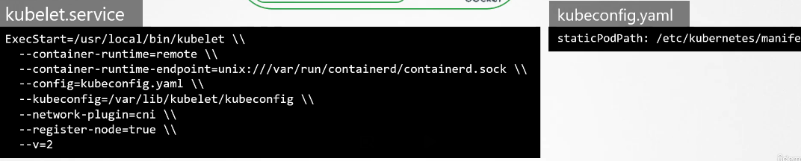

# Static Pods

from earlier data, it's known that kubelet depends on apiServer to provide details for the pod creation, what if apiServer does not provide these details.

you can configure the kubelet to read from a certain path the server any definition files of the pods, after placing the definition files in the directory, the kubelet periodically checks files in this path, reads any manifest in this path and creates pods on the hosts from the new manifest files not only it can create the pod, but it ensures that the pod stays alive.

if the application crashes, the kubelet recreates the pods, and if any changes was made on the manifests, the kubelet recreate the pods for those changes to take effect, and finally if you remove a file from this directory, the pod is removed automatically

only pods are created, not RSs or Deploys, as kubelets only understands file.

the default value for this directory is `/etc/kubernetes/manifests` it can be passed as an option or changed from `kubelet.service`


another way to do it is to put the configuration file path, and inside the file you set the staticPodPath



clusters set up by the kubeadm tool uses this approch

in this case there is no kubectl utility or kubectl pods, which makes us use the docker ps command, and in that case:

\- kubectl will see the pod created statically by creating a read-only mirror in the kube ApiServer

\- kubectl will not be able to edit or delete the static pod

\- viewing from the kube ApiServer (kubeadm/kubectl) the pod will be appended by the node name like (`static-pod-node01`)

## who do you know a static pod?

from the owner reference in the pod file:

`kubectl get pod kube-apiserver -n=kube-system -o yaml | grep owner `

if the owner type is Node, then it's a static pod

## why do you want static pods?

a one use case of it is to setup different Masternodes, that is done by creating a manifests for all the kube-system unitlities in the static path.

### Note that the kube-scheduler has no effect on this pods.

`/var/lib/kubelet/config.yaml`

### the command in manifest is written this way

```YAML
spec:
  containers:
  - image:
    name:
    command:
    - sleep
    - "1000"
```