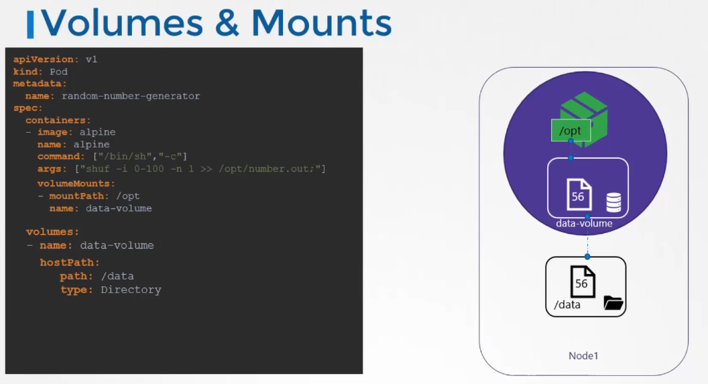
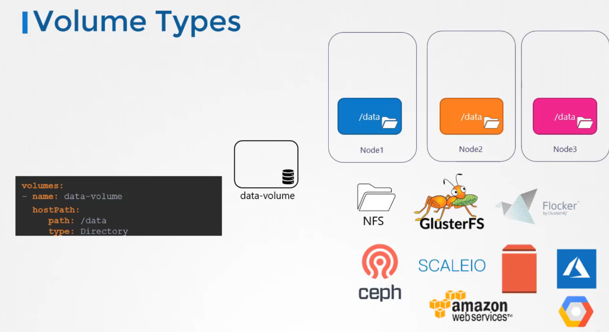

# Volumes

just like containers the pods are transient in nature and any volumes are meant to be destroyed along with the pods and to persist data, you need to create a volume.

```YAML
apiVersion: v1
kind: Pod
metadata:
  name: test-cinder
spec:
  containers:
  - image: k8s.gcr.io/test-webserver
    name: test-cinder-container
    command: ["/bin/sh","-c"]
    args: ["shuf -i 0-100 -n 1 >> /opt/number.out"]
    volumeMounts:
    - mountPath: /opt
      name: test-volume
  volumes:
  - name: test-volume
    hostPath:
      path: /data
      type: Directory
```

the data then is saved on the node itself on the directory of /data



## Volume storage options

hostPath can contain different types, and since you have one node, it's fine, but if you have multiple nodes the Directory type would generate multiple directories each for every node and they can't be the same, unless you configures external configured cluster storage solution.

Kubernetes supports different storage solutions on premises or public



for example for AWS EBS:

```YAML
apiVersion: v1
kind: Pod
metadata:
  name: test-ebs
spec:
  containers:
  - image: k8s.gcr.io/test-webserver
    name: test-container
    volumeMounts:
    - mountPath: /test-ebs
      name: test-volume
  volumes:
  - name: test-volume
    # This AWS EBS volume must already exist.
    awsElasticBlockStore:
      volumeID: "<volume id>"
      fsType: ext4
```

you need to specify the volume ID and Volume type.