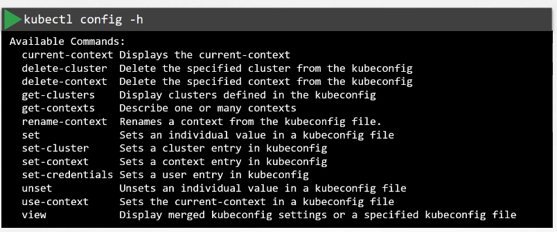

# kubeconfig

kubeconfig file is the basic file for remote authentication in Kubernetes

## the plain way

a way of authentication is using curl with the needed certificates
`curl https://my-kube-cluster:6443/api/v1/pods \`
`--key atta.key \`
`--cert atta.crt \`
`--cacert ca.crt`
How can you do that while using the kubectl command?, this can be specified in the kubectl command using the following:
`kubectl get pods \`
`--server my-cube-cluster:6443 \`
`--client-key atta.key \`
`--client-certificate atta.crt \`
`--certificate-authority ca.crt`
but for ease of use you move these configurations to a kubeconfig file and specify the in your command option, by default the kubectl tool looks for this option in your home directory under **.kube** directory, so if you created the file there you don't have to specify the option explicitly in your command

## KubeConfig

the kubeconfig consists of three sections Clusters, Users, and contexts. the contexts are used to define which user will access which cluster
an example for the config file

```YAML
apiVersion: v1
kind: Config
current-context: atta@qorrect
clusters:
- name: qorrect
  cluster:
    certificate-authority: /home/atta/.ssh/certificates/qorrect/ca.cert
    server: https://qorrect.com
context:
- name: atta@qorrect
  context:
    cluster: qorrect
    user: atta

users:
- name: atta
  users:
    client-certificate: /home/atta/.ssh/certificates/qorrect/atta.crt #this should be the signed certificate
    client-key: /home/atta/.ssh/certificates/qorrect/atta.key
```

**Note**: you better use the full path to your certificates and to be able to switch between the contexts:
`kubectl config view` then choose copy the name of your context and then
`kubectl config use-context atta@qorrect`

### Other options:

there are a lot of other options in `kubectl config -h `



## namespaces:

namespaces can be identified inside the context like below

```YAML
apiVersion: v1
kind: Config
current-context: atta@qorrect
clusters:
- name: qorrect
  cluster:
    certificate-authority: /home/atta/.ssh/certificates/qorrect/ca.cert
    server: https://qorrect.com
context:
- name: atta@qorrect
  context:
    cluster: qorrect
    user: atta
    namespace: alazhar

users:
- name: atta
  users:
    client-certificate: /home/atta/.ssh/certificates/qorrect/atta.crt #this should be the signed certificate
    client-key: /home/atta/.ssh/certificates/qorrect/atta.key
```

### Certificate as a decoded data

you can pass the certificate as a decoded data inside the config file as below, but Note that it must be base64 decoded

```YAML
apiVersion: v1
kind: Config
current-context: atta@qorrect
clusters:
- name: qorrect
  cluster:
    certificate-authority-data: LS0tLS1CRUdJTiBDRVJUSUZJQ0FURS0tLS0tCk1JSURCakNDQWU2Z0F3SUJBZ0lCQVRBTkJna3Fo
a2lHOXcwQkFRc0ZBREFWTVJNd0VRWURWUVFERXdwdGFXNXAKYTNWaVpVTkJNQjRYRFRJeU1EVXdPREV6TkRBME5Gb1hEVE15TURVd05qRXpOREEwTkZvd0ZURVRNQkVHQTFVRQpBeE1LYldsdWFXdDFZbVZEUVRDQ0FTSXdEUVlKS29aSWh2Y05BUUVCQlFBRGdnRVBBRENDQVFvQ2dnRUJBS0xaCmY0N3lYaFVxUjVGdmZMNDExd1Jka0FFSUJId0RWVFh3VWdjZExPZjk5K3lwUjdtc2w3cVpJZDFUYkphS1RtSzUKWGpZM2xsU2VHU1ZHYU5PdVRYVU9BajQ4eWsxM24rKzExQ3VucnE4QUxpalNXS1lJNDg3bVZaWGNFbFpyVTZJTgpQOU5yVVpqdG9xNmVwK2dMVUlrQXBkNE53b2g0NFJUSGJlTU9uZ3Zlc0ZGSDE3Z2lyNm9IT1RnYWVZcGQ4dzRYCk9XenhTT2J5UDhwNkZuYkZuTkJWdEpIejlpenNSbWRYajhhUTNSbzRObVpqRnJ6SDVqTy9Vd2FML0dyc2lQSzgKM3c5RWVXeTQwTkIxY2tPSnFUWGdZWFQwaUtXbWx2UnFVbEh2QlY5SnpZcTB2ZnZRM1Z5ekh5SWdXc3Y4KzljMQo4ZFpMUk13UEFLSUZCK3M2ZHprQ0F3RUFBYU5oTUY4d0RnWURWUjBQQVFIL0JBUURBZ0trTUIwR0ExVWRKUVFXCk1CUUdDQ3NHQVFVRkJ3TUNCZ2dyQmdFRkJRY0RBVEFQQmdOVkhSTUJBZjhFQlRBREFRSC9NQjBHQTFVZERnUVcKQkJUNTFORDR0N0tTTHZ4NVd6cnVWUVRDR0JKZkdUQU5CZ2txaGtpRzl3MEJBUXNGQUFPQ0FRRUFQQTAvK2syegpNUStMQXQzcmxvdDdEU0FGR3pKaG1hbGNlYVBXdjU1RE40MFZsd1Z0dU9GUmptZUpnbEpJYnRtMmNvZW0ySTlyCkcwY3g0ZDBaTHN0UGRmRWluRjhtNUJ3Tk94amZVMFhybzFhTUFvdFk0Zml0eFNneWtMN1hCODRIN21Ca1lzeEkKT0Y1WjVGVnNRSE5mSVNGVWNLM3lQcGhJUVFiUmF2TCtrbjlwSTkvQ1Y3UGNOSWZrV1E4ZGNCOXV3bmJ0bisyUQp5S3FxUGdFc0FqQTN6bFF0U0dpa1p6Y3NUMEdMY0M1SUxBelNiTXdkdkdaWVQ0ZUkwMWtlU1AvSDltSFBqSVBXCjMyUFNFU3dWcDJJYzFEQTA4NDVhbk56RVEyZDg2VkNZYi9taUd4N2kvaGJ2cTN3RFhQalFoWW5pWUdCUEV3TFAKUzRjTUc1WlJubjNzSmc9PQotLS0tLUVORCBDRVJUSUZJQ0FURS0tLS0tCg==
    server: https://qorrect.com
context:
- name: atta@qorrect
  context:
    cluster: qorrect
    user: atta
    namespace: alazhar

users:
- name: atta
  users:
    client-certificate: /home/atta/.ssh/certificates/qorrect/atta.crt #this should be the signed certificate
    client-key: /home/atta/.ssh/certificates/qorrect/atta.key
```

https://kubernetes.io/docs/tasks/access-application-cluster/configure-access-multiple-clusters/