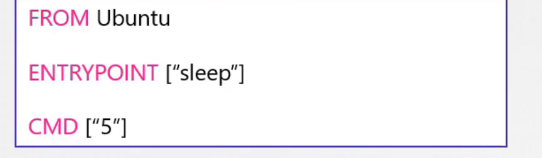

# sleep in Docker

the concept of containers is different from VMs it's not meant to host an OS, it simply runs a task or a process, once the task is complete the container exits. as well as if the service stops or exit, the container also exits

in order to make the docker image run without exiting you need to provide a command, like for example the ubuntu image that we run with the terminal option, because the command in it is bash

CMD "bash"

if you run the image without a terminal to operate this shell it will exit, you can parse another command like CMD " sleep 5: this will make it up for 5 seconds 

there are two ways for the command in docker

CMD command param1

CMD \["command","param1"\] -- CMD \["sleep","5"\] 

### Entrypoint

unlike the command CMD in docker, the Entrypoint instruction waits for you to append a parameter, but it works the same as the CMD, and if there is no parameter, you get and error that the operand is missing

in this case the container will sleep 10 seconds

**what if we need to make a default value if the user did not write any value in the operand?**

we simply use the two together,

in this case if the user adds an operand, it will overwrite the default value, and if not, the default value will take place.

**Important node: **in order for the file to work this way it must be written as a json array format with the \[" "\] in the both the ENTRYPOINT and CMD instructions 

lastly if you need to adjust the entrypoint you can run this command

`docker run --entrypoint sleep2.0 ubuntu-sleep 10` this will change the sleep with sleep2.0 and operand 10  `sleep2.0 10`